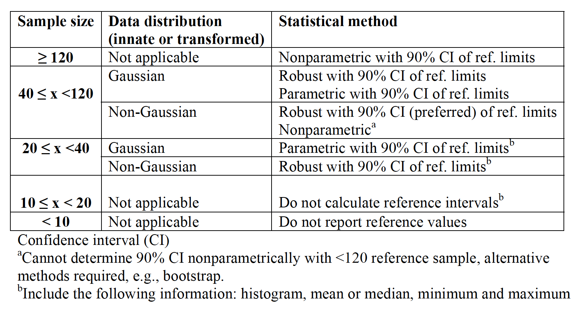
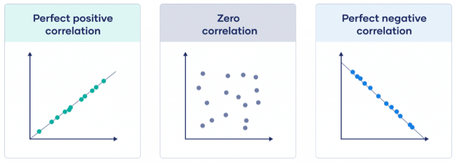
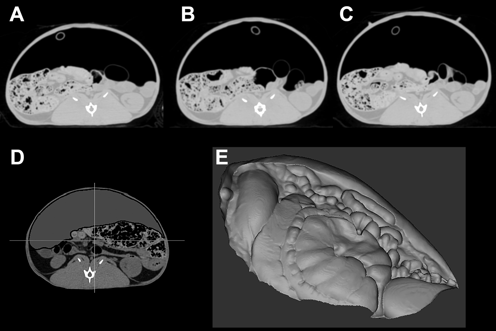
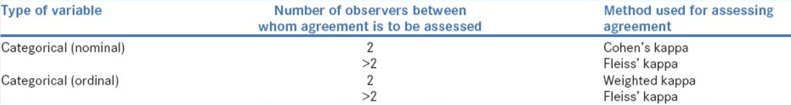

```{r setup, include=FALSE}
knitr::opts_chunk$set(echo = FALSE,tidy.opts=list(width.cutoff=80), tidy=TRUE,warning=FALSE)
library(learnr)
library(ZESTR) #important to load datafiles, DO NOT DELETE
library(nlme)
library(lme4)
library(survival)
library(survminer)
library(ordinal)
library(ggplot2)
library(ggrepel)
library(emmeans)
library(referenceIntervals)
library(reshape2)
library(binom)
library(nparcomp)
library(pwr)
library(car)
library(mice)
library(pROC)
library(MethComp)
library(epiR)
library(MASS)
library(Matrix)
library(DescTools)
```

```{r, echo=FALSE,out.width="30%",fig.align="center"}

```

*© Hugues Beaufrère - UC Davis School of Veterinary Medicine.  Version 1.0, 11-2023*

## Introduction

The objectives of this tutorial are to teach you how to:

-Perform statistics in a practical way to analyze your own research

-Focus on applied computational statistics using R without dwelling on underlying statistical theories and extensive demonstrations

-Focus on statistical techniques and their implementation for common study designs used in zoological medicine

-Learn how to generate great scientific graph of publication quality

There are different modules within this course. Feel free to jump directly to the module you want to complete, but be aware that prerequisite knowledge may be needed to understand the materials. This tutorial will take its examples from various real-life research projects on zoological animal species. While there is a focus on zoological medicine, everything is applicable across any veterinary clinical research discipline.

We won't cover statistical theory and probabilities and why it is important. The tutorial is  mainly made of snippets of practical R coding for common statistical uses. However, to think as a statistician, there are concepts that I would encourage you to explore such as probabilities, the central limit theorem, distribution of random variables, sampling distribution of the mean, principles of statistical inference and so on.

The R language is one of the top data science programming languages in the world, one of the most common softwares used in scientific publishing (along with SPSS and SAS), and is completely free. It is not often in life that one of the best things available is free.

The R system is based on objects and packages. By objects, I mean that R does not generate extensive outputs, but you need to ask for what you want and save it in various object types (like a data frame or a list for instance). By packages, I mean that R comes with certain base functions, but we typically require the use of more specific or more adapted functions that people code and release in the form of R-packages that are mostly hosted on the Comprehensive R Archive Network (CRAN). 

Some packages are really standalone programs. For instance, we will spend more time on the package "ggplot2" as it is becoming the standard for scientific graphing.

R can be used as a standalone software, but it is far easier to use with RStudio.

Tip #1: To import a dataset with RStudio, save your excel file as a csv file such as "dataname.csv" and import into R by clicking on environment (top right panel) and then the table icon "Import Dataset", then "from Text(base)".

Tip #2: If you want to restart this tutorial, go on the left panel, scroll to the bottom, and press "start over".

Tip #3: if you need assistance in coding in R, you can ask chatGPT to come up with R codelines for particular analysis and the results are often pretty good. Check it out on http://chat.openai.com.

Tip #4: prior to writing your scripts in RStudio, you need to open a Markdown document available at File/New File/ R Markdown. Then you save the file in the folder of your choice to keep your statistical codes. If you call functions that save files, they will be save in the same folder as the R Markdown file.

If you want to know more, there are lots of great resources online on R as well as great books. For books, I would recommend the following:

-[Introductory statistics with R](https://link.springer.com/book/10.1007/978-0-387-79054-1)

-[ggplot2: elegant graphics for data analysis](https://link.springer.com/book/10.1007/978-3-319-24277-4)

-Any books in the [Use R!](https://www.springer.com/series/6991/books) series

We'll only scratch the surface on computational statistics, but with luck, this tutorial will add a citrusy zest of statistical flavor to your program. Thanks for choosing this tutorial.

Please free to fill out the survey at the end of this tutorial so I can keep squeezing the most out of it.


```{r, echo=FALSE,out.width="60%"}


```


## The R environment {data-progressive=FALSE}
### An advanced calculator
First, R works like a mathematical calculator, so you can use it as such for a variety of applications. You just need to know the codes, which are fairly intuitive to calculate what you need. For instance square root is sqrt(), exponent is exp(), and 10^20 is 1e20.

*Try to enter some calculus and see what happens (example: 3+4 or sqrt(56))*

```{r calculus,exercise=TRUE }

```

You can also generate lists of numbers, this can be handy for some specific applications.

*Run the code*
```{r numbers, exercise=TRUE}
3:10 #gives you all numbers between 3 and 10
seq(1,10,by=0.5) #gives you numbers between 1 and 10 by 0.5 increments
rep(1:3,times=3) #repeats a vector of numbers
```

*Another thing that you need to know in R studio is that you can run lines separately or one by one by highlighting the segment you want to run and pressing command+return on mac or CTRL+return on PC. If you want to run a small chunk, just do the same after selecting the chunk with the mouse. Try it above.*

### R objects

R works with objects that can be of various types. They can be lists of numbers, lists of text strings, matrix, datasets (called dataframes), or output objects.
Let's start with simple objects. First we'll make a list of numbers, for instance the mean weight of some parrot species. The list is entered using the letter c and then you assign it with an arrow to an object. You can choose whatever name you want for that list.
In the following codelines, I created a list of weight.


*Run the code*
```{r make_a_list, exercise=TRUE}
c(450,400,140,200,120,90,35)->weight
```
Nothing happens, right!, it is because you entered numbers into a list, but if you want to see it again, you need to call it. Let's try it, go back to the chunk above, and type the name of the list right below the list generation codeline.

Ok, you can also use calculus with lists and apply functions.

*The "weight" list is in grams, try to transform it in kg, then try to log transform it*
```{r transform_weight-setup}
c(450,400,140,200,120,90,35)->weight
```
```{r transform_weight, exercise=TRUE}

```
```{r transform_weight-solution}
#weight/1000 or weight/1e3
#log(weight)
```
To save your calculation or transformation you will need to save the file into an R-object, you can overwrite weight for instance with "weight/1000->weight"

Another thing, it can be annoying to have lots of numbers after the decimal point. You can round up your data in R and tell the software how much precision you want using the command round(). See there:
```{r round-setup}
c(450,400,140,200,120,90,35)->weight
```
```{r round, exercise=TRUE}
round(weight/1000,2)
```


Alright, you can make lists with strings of text too

*Run the code*
```{r species_list, exercise=TRUE}
c("Grey parrot","Amazon parrot","Caique","Lorie","Quaker parrot","Cockatiel","Budgerigar")->parrots
parrots
```

You can combine these two lists into a matrix if you want, either combine them by columns or by rows.

*Run the code*
```{r combine_lists-setup}
c(450,400,140,200,120,90,35)->weight
c("Grey parrot","Amazon parrot","Caique","Lorie","Quaker parrot","Cockatiel","Budgerigar")->parrots
```
```{r combine_lists, exercise=TRUE}
cbind(weight,parrots)->data1
rbind(weight,parrots)->data2
data1
data2
```

### R functions

You can also create your own functions in case you have a particular task to repeat. For instance, there is no native function to get the standard error of the mean or the coefficient of variation in the base R program. You can create it like that:

```{r functions, exercise=TRUE}
std.error<-function (x) sd(na.omit(x))/sqrt(length(na.omit(x)))
coef.var<- function(x) round(sd(na.omit(x))/mean(na.omit(x))*100,1)

std.error(c(2,4,5,3,4,5,3,4))
coef.var(c(2,4,5,3,4,5,3,4))
```

## Data cleaning, organization, and subsetting {data-progressive=FALSE}

In this first part, we'll learn how to evaluate your dataset and look for errors as well as making sure all variables are correctly categorized.
First I have put example datasets into the package ZESTR that are already loaded in the background.

### Data cleaning and examination
Let's use the dataset "norepi", which is from a study on the use of norepinephrine as a vasopressor in rabbits (https://pubmed.ncbi.nlm.nih.gov/32826161/).
Let's call it and look at it

*norepi*
```{r}
norepi
```

You can quickly look at it and it seems to be ok. However, go to the last page of this dataset.

```{r quiz1}
quiz(
  question("What is wrong with this dataset?",
    answer("Nothing"),
    answer("Extra rows that do not match the variables", correct=TRUE),
    answer("Extra columns that do not match the variables"),
    answer("Too many missing values"),
    correct="Damn right! the researcher put extra rows at the end to define acronyms and when it got imported, it messed up the entire dataset"
  ))
```

Let's clean it up. If you go on page 8, you'll see that the last legit row is the row 72.
So we'll take a subset of this and overwrite the parent dataset. To subset a r*c data frame, you use these brackets []. The first value is for the rows and the second for the columns. The ":" sign means "to".

*Run the code*
```{r clean_norepi, exercise=TRUE}
norepi[1:72,]->norepi
norepi
```

When you import datasets into R, make sure there are no extra information that do not belong to the dataset and make sure all cells with missing values are left blank.

If you just want to look at the first few rows, you can do this (you will also see all the variables this way in this exercise). 

```{r clean_norepi_head, exercise=TRUE}
head(norepi)
```

For the opposite, to see the last few rows, replace "head" by "tail".

You can also extract the different variables (in the form of columns) using the $ sign. For r*c data frames, you need to put a comma to indicate the 2 dimensions (rows and columns). Let's look at the heart rate for instance.

*Example*
```{r norepi_hr-setup}
norepi[1:72,]->norepi
```
```{r norepi_hr, exercise=TRUE}
norepi$hr
```

Now, try to look at another factor, call for the factor trt, which represents the different treatments of this experiment.
```{r norepi_trt, exercise=TRUE, exercise.setup="norepi_hr-setup"}

```
```{r norepi_trt-solution}
norepi$trt
```
You can see that it gives you the factor levels at the end also. There is a better way to just get the levels of a factor, just to make sure there are no issues there (extra unintended levels will lead to unwanted comparisons when you run the stats)
```{r norepi_trt_levels, exercise=TRUE, exercise.setup="norepi_hr-setup"}
levels(norepi$trt)
```
Darn! The software counted some missing values (or maybe extra spaces instead of a truly blank cell on excel) as factor level in itself. This happens commonly. To get rid of it so it does not parasitize your analysis, you need to tell R which levels you want to keep. At this occasion, you can also tell R in which order you want them to be when you graph them.
```{r norepi_trt_levels_correct, exercise=TRUE, exercise.setup="norepi_hr-setup"}
factor(norepi$trt,levels=c("awake","baseline","low dose","medium dose","high dose","before recovery"))->norepi$trt
levels(norepi$trt)
```
You can also get the number of instances that each level of a factor was used in an experiment with this code (2 options):
```{r trt_level-setup}
norepi[1:72,]->norepi
factor(norepi$trt,levels=c("awake","baseline","low dose","medium dose","high dose","before recovery"))->norepi$trt
```
```{r trt_level, exercise=TRUE}
xtabs(~norepi$trt)
table(norepi$trt)
```

Now, remember that there were some additional rows with text information at the bottom of the dataset that interfered with it. We cleaned it up, but it had the deleterious effect of having R considered one of the variable as a factor when, in fact, it is a numeric variable. 
```{r}
norepi[1:72,]->norepi
```
```{r class, exercise=TRUE, include=TRUE}
class(norepi$weight)
```
You cannot get the mean or do any other calculations from a factor, so you need to either correct the excel sheet and reimport it into R or tell R to consider this variable as a number.
First let's try this:
```{r trt_number, exercise=TRUE, exercise.setup="trt_level-setup"}
as.numeric(norepi$weight)
```
Mmmh, what the heck just happened?
Actually, R just gives a number to each level of the factor. You need to convert it to text first, then to a number.
```{r trt_number2, exercise=TRUE, exercise.setup="trt_level-setup"}
as.numeric(as.character(norepi$weight))->norepi$weight
norepi$weight
```

The opposite may also occur for some factors that use numbers as labels and should not be considered as a number by R. This can later create some issues when modelling data.
In our case, the first variable, the ID variable, gives number to animals, but these numbers are not really more meaningful than having animals' names. Let's convert that to a factor.

```{r id_factor, exercise=TRUE}
as.factor(norepi$id)->norepi$id
levels(norepi$id)
```

There are some missing data points in this dataset. That means that, by default, R will remove the entire row of information when encountering these (listwise deletion). So you may want to have a quick overview of the missing data distribution.
```{r missing, exercise=TRUE, exercise.setup="trt_level-setup"}
sum(is.na(norepi$sap)) # get the number of missing values for one variable
summary(norepi) # get the number of missing values for all, last row of the table
```

Last, if you want to manually edit a dataset, then you can do that:
*Note/ there will be a pop up window, do your edit and close it*
```{r editing_manually, exercise=TRUE, exercise.setup="trt_level-setup"}
edit(norepi)->norepi
norepi
```

### Data re-organization and subsetting

#### Select rows and columns

Now, you may want to work with only parts of this dataset.
We have already reviewed the code to select only a subset based on rows and columns. Let see if you remember.

*Select the first 3 columns of norepi. Then try to select only the row 3 to 5.*
```{r subsetting1, exercise=TRUE, exercise.setup="trt_number2"}

```
```{r subsetting1-hint}
norepi[,1:3] #for the first one, try to do the second one on your own.
```
```{r subsetting1-solution}
norepi[3:5,]
```

*Let's try something harder, just extract the rows 1, 5, 7 and 15. (click on the solution if you are stuck)*

```{r subsetting2, exercise=TRUE, exercise.setup="trt_number2"}

```
```{r subsetting2-solution}
norepi[c(1,5,7,15),]
```

*Now try to select all the rows, except the row 5*

```{r subsetting3, exercise=TRUE, exercise.setup="trt_number2"}

```
```{r subsetting3-solution}
norepi[-5,]
```

#### Filter by a variable

You can also subset based on a value of a variable whether it is a factor or a numeric variable. This is handy when you want to subset with values that are spread out in the dataset.

For instance, let's subset norepi for the low dose treatment:

```{r subsetting4, exercise=TRUE, exercise.setup="trt_number2"}
norepi[norepi$trt=="low dose",]
```

To do the opposite, subsetting by removing data containing a certain value, you can do that (the sign different in R is !=).

```{r subsetting4bis, exercise=TRUE, exercise.setup="trt_number2"}
norepi[norepi$trt!="low dose",]
```

#### Filter by a value

Sometimes you have a huge range of values for a variable and you want to restrict the analysis for a certain set of values. In the following example, we are subsetting the data frame for all rows for which heart rate is below 200:

```{r subsetting5, exercise=TRUE, exercise.setup="trt_number2"}
norepi[norepi$hr<200,]
```


#### Reorganize by a variable
Let say now that you want to reorganize your dataset so it is ordered by treatment, you may need that for practical reasons.
```{r reorganize1, exercise=TRUE, exercise.setup="trt_number2"}
norepi[order(norepi$trt),]->norepi
norepi
```

#### Wide or long data set
Now, there are 2 ways to organize a whole dataset: the long and wide format. The "norepi" dataset is already organized in the long format, which is the most useful for statistical analysis using R. This means that there is only one variable per column and for variable that don't vary, the values get repeated. You can see this organization below:

```{r}
norepi
```

The wide format is when the categorical data are grouped in columns instead of being values in a single column. The result is that instead of having one variable per column, you have a variable that spans several columns.

To illustrate this concept, we will transform the norepi data fram from the long to the wide format for the heart rate (using package reshape2):

```{r wide, exercise=TRUE, exercise.setup="trt_number2"}
dcast(norepi[,c(1,4,6)],id~trt,value.var="hr",mean)
```
*Note/the Var.2 thingy is for the missing data, you can remove it later by subsetting*
You may not immediately see the point. But some statistical tests and some graphs may require your data to be in this format. Let say you want to do easy barplots and have one variable per bar, then wide format would be easier.

If your data is in the wide format (you imported it this way from an excel file and it would take a lot of time to convert it to long manually), you will probably have to convert it into a long format for statistical analysis.

```{r long-setup}
norepi[1:72,]->norepi
dcast(norepi[,c(1,4,6)],id~trt,value.var="hr",mean)->norepi.wide #the "mean" will average trt that are repeated (baseline here)
```
```{r long, exercise=TRUE}
melt(norepi.wide,id=c("id"),value.name="hr")
```

## Descriptive statistics and Data exploration {data-progressive=FALSE}
We'll use the dataset OwlCBC, which is from a study on hematologic reference intervals in North American owl species (https://pubmed.ncbi.nlm.nih.gov/25627556/).

```{r}
OwlCBC
```

### Basic functions
There are some cool and quick functions that you can use to have an initial feel of your data:
```{r basic_functions, exercise=TRUE}
sort(OwlCBC$pcv) #sort ascending or alphabetically
table(OwlCBC$species) #gives counts of values
unique(OwlCBC$pcv) #gives you all the unique values of a variable
duplicated(OwlCBC$pcv) #inform you of duplicates for particular values
```

### Basic numbers and data distribution
Descriptive statistics are used to summarize your data. You typically need at least 2 pieces of information: a measure of central tendency and a measure of dispersion You should not report one without the other. 
There are essentially two types of measures of central tendency, the mean (like an average) and the median (the value below and above which 50% of the data are). 
There are also two main types of measures of dispersion that are commonly used, the standard deviation and the interquartile range (the value representing the width between the 25% and 75% quantiles).

We are also adding the standard error of the mean and the coefficient of variation, two statistics we obtained by programming functions earlier.

Calculating standard statistics for pcv of owls:
```{r descriptive, exercise.setup="functions", exercise=TRUE}
mean(OwlCBC$pcv,na.rm=T) #the code "na.rm=T" tells R to run the command despite missing data
median(OwlCBC$pcv,na.rm=T)
sd(OwlCBC$pcv,na.rm=T)
IQR(OwlCBC$pcv,na.rm=T)

std.error(OwlCBC$pcv) #the function you made earlier, not a native function
coef.var(OwlCBC$pcv) #the function you made earlier, not a native function
```

Make sure you also understand the difference between the standard deviation and the standard error of the mean. The standard deviation is a measure of variability while the standard error of the mean is a measure of precision of your mean estimate (your mean is not the true population mean, it is just an estimate using a sample randomly taken from that population). According to the central limit theorem, the sampling distribution of most random variables is normally distributed as long as the sample size is large enough. This means that we can use the normal distribution to get confidence intervals on most statistics. 

One number you'll see throughout this tutorial is 1.96, which is the absolute z-score for the 2.5 and 97.5% percentiles of the normal distribution. You can look up what it means, but in practical terms, this is the number by which you need to multiply the standard error of the mean to get a 95% confidence interval. This is the 95% confidence interval of the mean for the PCV of owl. Within this interval are all the possible true means for the PCV of owl with a 0.95 probability. You can compare it to the mean pcv of another group of birds. If the other bird group's PCV is not within this interval, then it is significantly different with a p<0.05.

```{r descriptive2, exercise.setup="functions", exercise=TRUE}
mean(OwlCBC$pcv,na.rm=T)-1.96*std.error(OwlCBC$pcv)
mean(OwlCBC$pcv,na.rm=T)+1.96*std.error(OwlCBC$pcv)
```

Now, before we get any further, there is a mistake that you should not make. In the dataset OwlCBC, each row is a different bird. However, in the dataset norepi, it is in a long format and animals are repeated in rows because it is a repeated measure analysis. If you just do the mean or sd (or anything else) from that, you will calculate values including all the duplicates.
Let's illustrate this with getting the sd of the heart rate for the high dose norepinephrine:

```{r duplicate, exercise=TRUE}
sd(norepi$hr[norepi$trt=="high dose"], na.rm=T)
```
 Then let's do that removing the duplicates and compare the new sd:
```{r duplicate2, exercise=TRUE}
sd(norepi$hr[!duplicated(norepi$id[norepi$trt=="high dose"])], na.rm=T)
```
So make sure you tell R to remove duplicates when getting descriptive statistics from repeated measure datasets.

To be able to use the mean and sd, you need to have your data follow a normal distribution (bell curve). If that is not the case, the mean will not be a good measure of central tendency and you will need to use the median. Likewise, the sd will not be a good measure of spread, so you will need to use the IQR. For normally-distributed data, mean = median. The median is never wrong to use as it will always be meaningful.

To check for normal distribution, you can first look at the distribution of your data:

```{r freq, exercise=TRUE}
hist(OwlCBC$pcv,nclass=30)
```
```{r quiz2}
quiz(
  question("Does it seem to have a bell-curve?",
    answer("Yes",correct=TRUE),
    answer("No"),
    correct="Awesome, yes it looks roughly like a bell curve"
  ))
```

You can also use formal tests such as the Shapiro-Wilk test, but there are many others. The test tests for departure of the normal distribution, so if its p-value is below 0.05, then the departure from normal distribution is significant and your data should not be considered normal.

Let's give it a try:
```{r shapiro, exercise=TRUE}
shapiro.test(OwlCBC$pcv)
```
So it confirms that it is normally distributed

Formal normality tests are not very powerful and do not perform well on low sample sizes. In our case, we should be confident since we have 276 observations.

Another way to check for normality is to do a normal quantile plot. It plots your data against the normal distribution. If it is a straight line, then it is normally distributed.
```{r quantile_plot, exercise=TRUE}
qqnorm(OwlCBC$pcv)
qqline(OwlCBC$pcv)
```

So it is not completely on that line, so likely not completely normally distributed, but close.

Since we are on the normal distribution, there is an important property of it that you should know. It is called the empirical rule which states that when a variable follows a normal distribution, 68% of values are within 1SD and 95% are within 2SD. You can see that this will have many practical applications.

#### EXERCISE
Now, get me the best measure of central tendency and spread for the variable wbcL (white blood cell counts determined with leukopette).

There are probably some missing values in the dataset, so don't forget to use the option "na.rm=TRUE" for your descriptive stats.

*Note/ if you want to run only one line instead of the whole thing, just click on that line, then press Alt+Enter in PC and Command+Enter in Mac.*
```{r exercise1, exercise=TRUE}

```
```{r quiz3}
quiz(
  question("Was it normally distributed",
    answer("Yes"),
    answer("No",correct=TRUE)),
  question("Which summary statistics did you use?",
    answer("mean and standard deviation"),
    answer("median and interquartile range",correct=TRUE)
           )
  )
```

Other descriptive statistics include minimum, maximum, and various quantiles using the following functions:
```{r other_functions, exercise=TRUE}
min(OwlCBC$pcv,na.rm=T)
max(OwlCBC$pcv,na.rm=T)
quantile(OwlCBC$pcv,na.rm=T) #gets you the standard quantiles used in a boxplot
quantile(OwlCBC$pcv,probs=c(0.025,0.975),na.rm=T) #gets you defined quantiles such as for a non-parametric reference interval for instance
```

### Group Descriptions
Now, you may want to get summary statistics for your whole table to go quicker.
You just need to ask for a summary:

```{r summary, exercise=TRUE}
summary(OwlCBC)
```

Unfortunately, you don't get the standard deviation with that.
To get the standard deviation for all columns, you can do this:

```{r summary2,exercise=TRUE}
sapply(OwlCBC[,-1],sd,na.rm=T) #we removed the first column as it is a factor
```

Your turn! 

*Get me the interquartile range for all variables of that table.*

```{r summary3,exercise=TRUE}

```
```{r summary3-solution}
sapply(OwlCBC[,-1],IQR,na.rm=T)
```

Another thing you may want is a summary statistic, such as the mean, as a factor of another variable.
For instance, it does not make sense to report the overall PCV for owls, we want instead the PCV by owl species:

```{r summary4, exercise=TRUE}
by(OwlCBC$pcv,OwlCBC$species,mean,na.rm=T) #the "na.rm=T" allows to use data with missing values. Remove it if you want to see the results.
```

*Now, give me the sd of wbcL by species:*

```{r summary5, exercise=TRUE}

```
```{r summary5-solution}
by(OwlCBC$wbcL,OwlCBC$species,sd,na.rm=T)
```

### Data transformations
Data transformation using R is pretty easy. The goal of data transformation, in most instances, is to approach a normal distribution so you can use parametric statistics on it.
If you remember, the pcv of owls was not normally distributed, but fairly close.
```{r}
"Q-Q plot"
qqnorm(OwlCBC$pcv)
qqline(OwlCBC$pcv)
```

Let's do a log transformation and do the Q-Q plot again. 

*I think you can do it, click on "solution" if you are stuck.*

```{r transform, exercise=TRUE}

```
```{r transform-solution}
log(OwlCBC$pcv)->OwlCBC$pcv
qqnorm(OwlCBC$pcv)
qqline(OwlCBC$pcv)
```
It seems to have worked. If you run a Shapiro-Wild test, you'll see that it checks out there too.
```{r transform2, exercise=TRUE}
shapiro.test(log(OwlCBC$pcv))
```

If you do anything on this transformed data, you need to transform back for interpretation. In the case of the mean, if you transform back (exponent), then you get the geometric mean.
```{r trasnform3, exercise=TRUE}
log(OwlCBC$pcv)->OwlCBC$pcv
exp(mean(OwlCBC$pcv,na.rm=T))
```

If you get an error with log transformation, it is possible that it is due to the presence of 0s in your dataset as log(0) is impossible. In this case, you can replace 0s by very small values such as 0.001 for instance (use the edit function if you want to do that)
```{r log, exercise=TRUE}
log(0)
```

Other classic transformations include square root, exponentiation, rank, and Box-Cox transformations. Transforming your data will significantly increase the difficulty of interpreting the results. Overall, it is best to just use non-parametric statistics for non-normal data whenever possible.

### Descriptive graphs
As the saying goes: a picture is worth a thousand statistical codelines!

#### Boxplots
The best graph you can do to summarize data is a boxplot. The boxplot gives you the median (central line in the box), the interquartile range (box), minimum and maximum (whiskers) and outliers (points on the outskirt).
A quick way to do it in R is:
```{r boxplot, exercise=TRUE}
boxplot(OwlCBC$pcv~OwlCBC$species,las=2,xlab="",ylab="PVC (L/L)") #las=2 puts the species name at a 90 degree angle so they don't overlap
```
Modify the codeline to get the same for wbcL and wbcS

A better way to do it with GGPLOT2 (the best package for graphing) is:
```{r boxplot2,exercise=TRUE}
ggplot(OwlCBC,aes(x=species,y=pcv))+geom_boxplot(aes(fill=species))+xlab("Species")+ylab("PCV (L/L)")+theme_classic()+theme(text=element_text(size=15),axis.text.x=element_text(angle=40,hjust=1),legend.position="none")
```

Note/ we'll talk more about GGPLOT2 in the "Advanced Scientific Graphing" module, so don't stress too much about the coding.

#### Bargraphs
You can do barplots too, but they are not great to summarize data in general. Here is the ggplot code for a barplot accross species with errorbars.
```{r barplot1,exercise=TRUE}
ggplot(data=OwlCBC,aes(x=species,y=pcv))+stat_summary(geom="bar",fun=mean,position="dodge",aes(fill=species))+stat_summary(geom="errorbar",fun.data=mean_se,position="dodge")+theme_classic()+theme(text=element_text(size=15),axis.text.x=element_text(angle=40,hjust=1),legend.position="none")
```
With ggplot, you have to code for every single little thing in the graph that you want. The first part calls the different variables, then the stat_summary thingy asks for the mean in a bar form, then the errorbars and then there are some formatting bits and pieces. Again, we'll review ggplot later so please relax.

#### Scatterplots
Scatterplots do not perform any statistics, they just graph each data points as is. They can be very useful in some instances. You typically use them when graphing 2 continuous variables together on the same plot.

For instance, we'll compare the WBC in owls obtained using 2 different techniques on a scatterplot.
The quicker way to do it in R using its base function is this:
```{r scatterplot,exercise=TRUE}
plot(OwlCBC$wbcL,OwlCBC$wbcS)
```
You can add a reference line at x=y (the 2 techniques are identical) by adding abline(0,1) in an extra line to the codeline above (note: 0 is the intercept and 1 the slope)

Again, with ggplot, you can do better stuff using the geom_point graphical function and some nice formatting codes. See for yourself:
```{r scatterplot2, exercise=TRUE}
ggplot(data=OwlCBC,aes(x=wbcL,y=wbcS))+geom_point(aes(color=species))+geom_abline(intercept=0,slope=1)+theme_classic()+theme(text=element_text(size=15))
```
Note/ Did I tell you that we would review ggplot codes later or that you could jump directly to the "Advanced scientific graphing" module if you just cannot wait.

## Refererence Intervals
First real application of statistics to an actual study. In veterinary medicine, we try to follow the statistical guidelines from the ASVCP, which are as described in the table below:

ASVCP Guidelines: Recommended procedures for establishing RI based on reference sample size and distribution:

```{r, echo=FALSE,out.width="80%",fig.align="center"}

```


You can see that there are many different techniques. The recommended technique depends both on sample size and on data distribution.
Let's use the dataset OwlCBC again on hematologic variables in owl species:

```{r}
OwlCBC
```

We'll determine reference intervals for the white blood cell count determined using a Leukopette technique (wbcL).
First we need to get the sample size:
```{r sample_size, exercise=TRUE}
length(OwlCBC$wbcL) #overall sample size for wbcL - includes missing value
length(na.omit(OwlCBC$wbcL)) #true sample size without the missing values
table(na.omit(OwlCBC$species)) #sample size by species
```

ok, we'll first determine the overall reference interval for all the owl species combined.

*Do you remember how to check whether wbcL is normally distributed (you did it before)?*
```{r normality, exercise=TRUE}

```
```{r normality-solution}
shapiro.test(OwlCBC$wbcL) #Shapiro-Wilk test
qqnorm(OwlCBC$wbcL) #quantile plot technique
qqline(OwlCBC$wbcL)
```

```{r quiz4}
quiz(
  question("What reference interval technique should we use?",
    answer("Parametric"),
    answer("Non-parametric",correct=TRUE),
    answer("Robust")
  ))
```

*Then you need to give basic summary statistics.*
```{r reference1,exercise=TRUE}

```
```{r reference1-solution}
median(OwlCBC$wbcL,na.rm=T)
min(OwlCBC$wbcL,na.rm=T)
max(OwlCBC$wbcL,na.rm=T)
IQR(OwlCBC$wbcL,na.rm=T)
```

Ok, for the reference interval in itself, we will use the package referenceIntervals which complies with the ASVCP guidelines. It is very easy to use, please see the following code for how to use it. 

```{r reference2,exercise=TRUE}
refLimit(na.omit(OwlCBC$wbcL),out.method="horn",RI="n") #out.method is for outlier determination and for RI methods you can use n for non-parametric, p for parametric, and r for robust
```

Ok, so it gives you already everything that you want, the 95% reference interval with the 90% confidence intervals on the upper and lower limit. 

Sometimes, you need to remove outliers depending on whether it is indicated (laboratory error, too extreme, please read the ASVCP guidelines)
Let's remove the 0.38 outlier which is fairly extreme.
```{r reference3,exercise=TRUE}
refLimit(na.omit(OwlCBC$wbcL[OwlCBC$wbcL!="0.38"]),out.method="horn",RI="n")
```

If you want to remove all outliers, just add out out.rm=TRUE to the codeline. 

### EXERCISE
Ok, now we don't really report reference intervals for a whole order of birds, but mainly at the species level.
Could you get the reference interval for great horned owl (GHOW) using the appropriate method complying with the ASVCP guidelines?
```{r reference4, exercise=TRUE}

```
```{r reference4-solution}
shapiro.test(OwlCBC$wbcL[OwlCBC$species=="GHOW"]) #it's normally distributed
table(OwlCBC$species) #sample size is 35
mean(OwlCBC$wbcL[OwlCBC$species=="GHOW"],na.rm=T) #summary statistics
sd(OwlCBC$wbcL[OwlCBC$species=="GHOW"],na.rm=T)
min(OwlCBC$wbcL[OwlCBC$species=="GHOW"],na.rm=T)
max(OwlCBC$wbcL[OwlCBC$species=="GHOW"],na.rm=T)
refLimit(OwlCBC$wbcL[OwlCBC$species=="GHOW"],out.method="horn",RI="p") #we used a parametric technique
```

## Basic Epidemiologic Analysis
For this section, we'll work with the QuakerEpidemio dataset, which includes data on the frequency of lipid related disorders in Quaker parrots (https://pubmed.ncbi.nlm.nih.gov/30244665/).

```{r}
QuakerEpidemio
```

The prevalence is the rate of disease at a certain time. It is different from the incidence, which is the rate of new cases per unit of time.

For instance, let's get the prevalence of hepatic lipidosis:

```{r prevalence, exercise=TRUE}
table(QuakerEpidemio$lipidosis) # count the number of Quakers with and without the disease
prop.table(table(QuakerEpidemio$lipidosis)) # convert to percentages
```

*I let you do the same for the prevalence of atherosclerosis*

```{r prevalence2, exercise=TRUE}


```
```{r prevalence2-solution}
table(QuakerEpidemio$atherosclerosis)
prop.table(table(QuakerEpidemio$atherosclerosis)) 
```

When reporting prevalences (and percentages in general), it is optimal to report the 95% binomial confidence interval as well. You can do that using the R-package "binom".
Instead of putting the percentage directly, you need to provide the number of positives and the sample size. The code below is for the confidence interval for the prevalence of hepatic lipidosis.

```{r prevalence3, exercise=TRUE}
binom.confint(87,411,conf.level=0.95,methods="all")
```
It gives the results using several methods. I typically use the asymptotic method.

Alright, now you may want to get the prevalence by sex for instance, and maybe compare these prevalences. For this, you can start by doing a contingency table.

```{r prevalence4, exercise=TRUE}
prop.table(table(QuakerEpidemio$lipidosis,QuakerEpidemio$sex),margin=2) # divides by the column sum, margin=1 would divide by the row sum
```

mmh, you can see that males seem to have a higher prevalence than females. To compare proportions, a chi-square test can be done:

```{r prevalence4chi, exercise=TRUE}
chisq.test(table(QuakerEpidemio$lipidosis,QuakerEpidemio$sex))
```

Indeed, you see that it is highly significant with a p=0.001

Note that there are lots of missing values for sex, so you removed quite a few birds for these statistics. It would be best to use multiple imputation to deal with missing values in this example rather than listwise deletion. We'll cover that later.

*Do you remember how to get the rate of missing values for sex in this dataset:*

```{r prevalencemissing, exercise=TRUE}


```
```{r prevalencemissing-solution}
sum(is.na(QuakerEpidemio$sex)) #number of missing data points
sum(is.na(QuakerEpidemio$sex))/length(QuakerEpidemio$sex) #percentage of missing values for sex
```

*Now, get me the prevalence of atherosclerosis in Quaker parrots by sex with confidence intervals. Please test whether the prevalence is significantly different by sex.*

```{r prevalence5, exercise=TRUE}


```
```{r prevalence5-solution}
table(QuakerEpidemio$atherosclerosis,QuakerEpidemio$sex)
prop.table(table(QuakerEpidemio$atherosclerosis,QuakerEpidemio$sex),margin=2) 
binom.confint(5,146,conf.level=0.95,methods="asymptotic")
binom.confint(11,141,conf.level=0.95,methods="asymptotic")
chisq.test(table(QuakerEpidemio$atherosclerosis,QuakerEpidemio$sex))
```
```{r quizprevalence}
quiz(
  question("Is the prevalence of atherosclerosis different by sex in this species?",
    answer("Yes"),
    answer("No",correct=TRUE)
  ))
```

We could investigate the other risk factors in that dataset, but that would require the use of a logistic regression. We'll come back to that in the chapter on categorical data analysis and logistic regression.

## Setting up an experiment

There are different steps you need to follow to set up an experiment.

### Choosing an experimental design
- First, you need to decide of a design depending on your research hypothesis and research constraints.
The most common types of experiments include the complete randomized design (most basic design, testing all levels of 1 factor), the block randomized design (controlling for a particular confounding variable such as observer or sex for instance), the full factorial design (testing all combinations of several factors) and the repeated measure design (which can be a cross over study). Most of these designs will be analyzed using t-tests, anova, linear models or linear mixed models.

### Sample size analysis
- Second you need to decide on a sample size. It is typically done using a sample size analysis. You need to consider different parameters such as an alpha=0.05 (rate of type I error), a power of 80% (probability of finding an effect, also means a rate of type II error of 20%), the expected variability of the data (is it more like 5% or 20%), and the effect size (can be estimated using Cohen's d with 0.2 being small, 0.5 being medium, and 0.8 being large for instance). You typically either specify the different means and variability or the effect size, which takes that into consideration.

Let's go through some examples just using the effect size as it is simple. I won't cover all the different types of analysis for which you would need a sample size analysis, just the most common.

For instance, we would like to compare the white blood cell counts between 2 related owl species, the great horned owl and the snowy owl (dataset OwlCBC).

```{r}
OwlCBC
```

#### Two sample study
We would like to know how many owls in each species we would need to sample controlling for a type I error of 5%. We could also think that the difference is expected to be high considering that they are coming from different biotopes, so let's try an effect size of 0.8.
Note: the effect size formula is (mean1-mean2)/common sd.

```{r power, exercise=TRUE}
pwr.t.test(d=0.8,sig.level=0.05,power=0.8, type=c("two.sample"))
```
You would need 25 owls in each group.
Let's check our sample size in the OwlCBC dataset
```{r power2, exercise=TRUE}
length(OwlCBC$species[OwlCBC$species=="GHOW"])
length(OwlCBC$species[OwlCBC$species=="SNOW"])
```
We are close to what is recommended, but we have an uneven sample size.
Let's do a t-test and get mean and sd per group and see what we got.
```{r power3,exercise=TRUE}
t.test(OwlCBC$wbcL[OwlCBC$species=="GHOW"],OwlCBC$wbcL[OwlCBC$species=="SNOW"])
```
So we got a significant difference. You can see what the power was with the following code keeping the same alpha and power (we got the means from the previous code and we got the SD from the module on descriptive statistics on the same dataset).
```{r power4, exercise=TRUE}
pwr.t2n.test(d=(18.3-9.6)/8.5,n1=35,n2=13,sig.level=0.05)
```
You see that the power was actually quite large, which allowed us to find the difference with our constraints.
If the difference between the 2 species was milder, it would have been hard to find it. Let's say, you would like to run the same analysis with the same exact sample sizes, but for 2 species that are more similar in white blood cell count, and you expect a mild effect size this time.

```{r power5, exercise=TRUE}
pwr.t.test(d=0.5,power=0.8,sig.level=0.05,type=c("two.sample"))
```
You would need at least 60 animals in each group.
If you want to do the same, but for paired sample (using the same individuals for comparisons), you just need to change "two.sample" for "paired" in the above codeline, please try it.

*Now, try to think of one of your past studies that was a 2-sample simple study. Estimate the effect size and keep the alpha and power at the same levels as in the examples. Compare the sample size that you got with what you used in your study and whether or not you were able to find a difference.*
```{r power6,exercise=TRUE}

```
```{r power6-hint}
pwr.t.test(d=effect.size,power=0.8,level=0.05) #d=0.2 for small, d=0.5 for medium, d=0.8 for large
```

#### More than 2 groups
That would be an ANOVA to compare results between different treatments/groups, but belonging to the same variable (the variable treatment for instance or in our case, the variable species)
Let's look at the sample size needed per species for white blood cell counts of owls to see if there is species that differs from the others.

First, let's see the number of owl species that we have. 
*Please try to get it yourself.*
```{r power7, exercise=TRUE}


```
```{r power7-solution}
length(unique(OwlCBC$species))
```

You can do the sample size analysis with an expected large effect size for at least one species being different within the 13 species that we have using this codeline.
K is the number of groups and f is the effect size there (ANOVA is a F-test). In this situation, a small effect size would have f=0.1, a medium f=0.25, and a large f=0.4.

```{r power8, exercise=TRUE}
pwr.anova.test(k=13,f=0.4,sig.level=0.05,power=0.8)
```

As we did earlier, let's then look at our actual sample size per species to compare with what we should have had, I let you do it.
```{r power9, exercise=TRUE}

```
```{r power9-solution}
table(OwlCBC$species)
```
So it seems that we have n=9 for most species, let's run an ANOVA, we should find a difference if the effect size is indeed large:
```{r power10, exercise=TRUE}
anova(lm(data=OwlCBC,wbcL~species))
```
Awesome, we indeed got a significant difference (p-value is under the heading "Pr(>F)"). Then you would have to do a post-hoc test to see which species are different from which (see later).

If you want to run other power analysis/sample size analysis, please look at other functions of the package pwr. You can also download the free software G*power, which is great at:
https://www.psychologie.hhu.de/arbeitsgruppen/allgemeine-psychologie-und-arbeitspsychologie/gpower.html

### Randomization
- Third, you need to randomize the treatment to the experimental units. The randomization needs to follow the rules of the design, so for blocked designs or cross-over studies, there will be added steps. In general, you need a number of animals that is a multiple of the number of treatments for a balanced design.

#### Simple randomization

Let's start by how to randomize a simple experiment such as a complete randomized design.
Let say that you want to study the effect of 2 drugs (plus control, so 3 treatments total) on birds. 
You expect a large effect size.

*How many different birds do you need per group:*
```{r crd1,exercise=TRUE}

```
```{r crd1-solution}
pwr.anova.test(k=3,f=0.4,sig.level=0.05,power=0.8)
```
Ok, you should have gotten about 21 birds per group, so a total of 63 birds. Let's assume that the birds ID are #1 to #63.
Now let's assign Treatment 1, Treatment 2, and Control to the birds.
First the command to take a random sample is the following, so we are taking 21 birds at random in our colony of 63 birds.
```{r randomization1, exercise=TRUE}
sample(63,21)
```
The issue is that you need to do that 3 times without replacement. So let's sample all 63 birds and put them in 3 columns instead:
```{r crd2,exercise=TRUE}
matrix(sample(63,63),ncol=3)
```
Then you can assign the treatment names to the columns:
```{r crd3,exercise=TRUE}
matrix(sample(63,63),ncol=3)->experiment1 #same as above, but saves it into a matrix you can recall
c("Treatment 1","Treatment 2","Control")->trt #make a list of the treatment names
sample(trt,3)->colnames(experiment1) #assigns the treatment names to the column in a random fashion
experiment1 #recalls the design so you can see it
```
Here you go!

Your turn. You have a colony of 24 bearded dragons (called 1 to 24) and you want to test the effect of 3 doses of alfaxalone (5 mg/kg, 10 mg/kg, and 15 mg/kg) on the duration of sedation. You want to compare it to your control protocol to see if it is better (propofol 10 mg/kg IV). Each bearded dragon only receives one dose, so it is a complete randomized design.
Randomize the experiment:
```{r randomization2, exercise=TRUE}


```
```{r randomization2-solution}
matrix(sample(24,24),ncol=4)->dragon.experiment
c("A 5mg/kg","A 10 mg/kg","A 15 mg/kg","P 10 mg/kg")->trt
sample(trt,4)->colnames(dragon.experiment)
dragon.experiment
```
To randomize a factorial design with several factors, each having several levels, you just do as for the complete randomized design with all the combinations.
For instance, you want to see the effect of one drug at 3 doses (plus control) and 3 different temperatures on the length of sedation of bearded dragons. You would consider this as a complete randomized design with 4*3=12 treatments. So you would need quite a number of bearded dragons for such a study.

#### Blocked design

Keeping the examples of the bearded dragon alfaxalone study. Imagine now that you would like to take into considerations the effect of sex (males vs females). Then you would need to have each group get an equal number of males and females (you are blocking for sex) in case there is a sex effect. The effect of sex on the duration of sedation is not your primary outcome of interest, but you cannot discount it and it is best to account for it in the design by blocking for sex.
So we have 24 dragons, let's say that sex is randomly distributed in this dataset. Let's make an object that accounts for this:
```{r blocked1,exercise=TRUE}
seq(1:24)->ID
c(rep("female",12),rep("male",12))->sex
sample(sex,24)->sex
cbind(ID,sex)->dragons # combine the lists by columns
as.data.frame(dragons)->dragons #transform it as a data.frame, which is easier to manipulate
dragons
```
Ok, so the easiest would be to randomize the females separately from the males. For this, we'll create 2 matrices and do what we did above for each matrix, then we'll combine them and assign labels to the columns (treatments) and rows (sex). You basically randomize within blocks
```{r randomization3-setup}
seq(1:24)->ID
c(rep("female",12),rep("male",12))->sex
sample(sex,24)->sex
cbind(ID,sex)->dragons # combine the lists by columns
as.data.frame(dragons)->dragons #transform it as a data.frame, which is easier to manipulate
dragons
```
```{r randomization3,exercise=TRUE}
matrix(sample(dragons$ID[dragons$sex=="female"],12),ncol=4)->females #randomizing the females
matrix(sample(dragons$ID[dragons$sex=="male"],12),ncol=4)->males #randomizing the males
rbind(females,males)->dragons #combine the female and male randomization by rows
c("A 5mg/kg","A 10 mg/kg","A 15 mg/kg","P 10 mg/kg")->trt
c(rep("female",3),rep("male",3))->sex
sample(trt,4)->colnames(dragons)
sex->rownames(dragons)
dragons
```

For more complex blocked designs, you can just repeat and expand the codelines in this example. Just remember that you need to randomize within blocks and that you need to have a sample size within blocks that is a multiple of the number of treatments or you won't be able to do it. For instance, in the above example, we have a number of males and a number of females which is a multiple of the number of treatments.
Most often in zoological discipline, we don't block for sex or age or other variables and just do a complete randomized design. However, it will be less powerful as you don't control the variability associated with sex, age, or other confounding variable. So make sure you think about the need for blocks and design your experiment accordingly to maximize power.

#### Cross-over study

Alright, this is a design that comes up fairly commonly in zoological medicine and that is often not appropriately designed. A cross-over study is basically an experiment in which all treatments are administered to all subjects.
Remember the first study that we randomized in this section. We needed a total of 63 birds as you had 3 treatments and needed 21 birds per treatment. What if we only used the 21 birds and just applied the 3 treatments in a sequence, this would be more convenient and would allow us to keep a smaller colony of birds. There are 2 things to consider when designing such a study:

- A treatment may carry-over to the subsequent treatment in the sequence.

- Animals may respond differently to a treatment administered first or later (they may adapt or have different levels of anticipation for instance)

To control for these pitfalls, we need to minimize carry-over effects by using a sufficiently long wash-out period and then you need to balance the design for carry-over effects and order effects in such a way that each treatment precedes and follows each other treatment an equal number of time. Despite the wash-out period, if there was still a carry-over effect, it may be evenly spread out in the results and it won't confound your results.

The best way to do it is to use a replicated latin square design. Why not using a single latin square, because you need replications.

Let's redesign our first experiment, but as a cross-over study this time. Since it is a latin square design, the number of birds need to be a multiple of the number of treatments. We have 21, which is a multiple of 3 and will give us 21/3=7 sequences of treatment.
We start by creating one latin square 3x3, then we repeat it 7 times.
A 3x3 latin square looks like that:
```{r}
matrix(c(1,2,3,2,3,1,3,1,2),nrow=3,byrow=T)
```
Let's randomize the rows, then randomize the columns to obtain a random latin square.

```{r crossover1,exercise=TRUE}
matrix(c(1,2,3,2,3,1,3,1,2),nrow=3,byrow=T)->rand
rand[sample(3,3),]->rand
rand[,sample(3,3)]->rand
rand
```

Then we replicate it (7 times). We take the opposite latin square and then alternate them. Then we assign birds to the columns and treatment to the rows.
```{r crossover2-setup}
matrix(c(1,2,3,2,3,1,3,1,2),nrow=3,byrow=T)->rand
rand[sample(3,3),]->rand
rand[,sample(3,3)]->rand
rand
```
```{r crossover2,exercise=TRUE}
rand[3:1,]->rand2
cbind(rand,rand2,rand,rand2,rand,rand2,rand)->rand #replicating 7 times the latin squares
c(1:21)->birds
sample(birds,21)->colnames(rand)
c("trt A","trt B","control")->trt
trt->rownames(rand)
rand
```
Here we go, the number within the tables represent the order of treatment.

There is still an issue with this design, is that there is an odd number of replication because we used an odd number of birds (which was still a multiple of the number of treatments). To truly have a balanced cross-over design, you would have to replicate the whole design with the inversed matrix. It is a lot of work and each bird would do the experiment 6 times. So it is better to just stick to an even number of replicates and not use the whole colony. In our situation, with a colony of 21 birds and 3 treatments, it would be better to use 3*6=18 birds.

*Please redesign this experiment for 18 birds instead of 21:*

```{r crossover3,exercise=TRUE}

```
```{r crossover3-solution}
matrix(c(1,2,3,2,3,1,3,1,2),nrow=3,byrow=T)->rand
rand[sample(3,3),]->rand
rand[,sample(3,3)]->rand
rand[3:1,]->rand2
cbind(rand,rand2,rand,rand2,rand,rand2)->rand
c(1:18)->birds
sample(birds,18)->colnames(rand)
c("trt A","trt B","control")->trt
trt->rownames(rand)
rand
```


#### Conclusion
So in conclusion, you need to randomize according to the rules of randomization of your experiment. You can just randomize your subjects to treatments in a complete randomized design, but you need to randomize within blocks for a blocked design, or using replicated latin squares for a cross-over study balanced for carry-over and order effects.

There are other designs that can be used and that have specific randomization rules. One I like to use from time to time is the BIBD: balanced incomplete block design. It is a design that I use when I have a lot of treatments or time points, but I don't have enough animals or enough money. So I do an incomplete design where not all combinations of treatments or factors are present. These designs can be as good as a complete randomized design or complete cross-over study with up to 80-90% of efficiency. Please look it up if you are interested in such a design.

An example of study using a BIBD can be found [here](https://pubmed.ncbi.nlm.nih.gov/25867662/).

## One-sample and Two-sample tests

A one sample test is when you compare your data to a specific predetermined mean and a two-sample test is when you compare two sets of data together. Remember that most of standard statistics are based on hypothesis testing with the null hypothesis being the status quo.

Tests can be parametric (assume a normal distribution) or non-parametric (distribution-free).

### Parametric tests
This is essentially the well-known t-test. The t-test has 2 key assumptions: normality and homoscedasticity (homogeneous variances). It is also best if the groups are balanced.
Let's work with the CholesterolMeter dataset, which represents the comparison between two cholesterol assays in parrots, a point-of-care cholesterol meter and a standard laboratory analyzer (https://pubmed.ncbi.nlm.nih.gov/31124606/).

```{r}
CholesterolMeter
```

First, we need to check whether the variables cholesterol.meter and cholesterol.lab are normally distributed.

*You know how to do that:*
```{r parametric1, exercise=TRUE}

```
```{r parametric1-solution}
shapiro.test(CholesterolMeter$cholesterol.meter)
shapiro.test(CholesterolMeter$cholesterol.lab)
qqnorm(CholesterolMeter$cholesterol.meter)
qqline(CholesterolMeter$cholesterol.meter)
qqnorm(CholesterolMeter$cholesterol.lab)
qqline(CholesterolMeter$cholesterol.lab)
```

Alright, so it seems that the variable cholesterol.lab is not normally distributed. Before moving on to non-parametric tests, we can see if we can transform the variable to make it normally distributed. The most common way of doing this is log transformation.

```{r parametric2, exercise=TRUE}
shapiro.test(log(CholesterolMeter$cholesterol.lab))
```
It is still not normally distributed. Let's inspect the data to make sure there are no outliers that skew our data:

```{r parametric3, exercise=TRUE}
plot(CholesterolMeter$cholesterol.lab) #plot the data
text(CholesterolMeter$cholesterol.lab,labels=rownames(CholesterolMeter),pos=4) #label the data, offset text to the right
```
So the 21st parrot seems to be really out there, let's remove it and check normality with and without log transformation

```{r parametric4, exercise=TRUE}
shapiro.test(CholesterolMeter$cholesterol.lab[-21])
shapiro.test(log(CholesterolMeter$cholesterol.lab[-21]))
```
Ok, so removing this outlier and log transforming the data allows to get a normal distribution, great. Let's now test for homogeneity of variances for both log-transformed data removing the observation 21. We can do a Levene's test if you want a formal test, but just doing boxplots and assessing graphically is enough in my opinion.

```{r parametric5,exercise=TRUE}
boxplot(log(CholesterolMeter$cholesterol.meter[-21]),log(CholesterolMeter$cholesterol.lab[-21]))
```

So it looks roughly like variability is similar between groups.
Let's now do our two-sample t-test:

```{r parametric6,exercise=TRUE}
t.test(log(CholesterolMeter$cholesterol.meter[-21]),log(CholesterolMeter$cholesterol.lab[-21]))
```

Alright, there is a significant difference between the two. You need to transform back to see the differences in geometric means:

```{r parametric7,exercise=TRUE}
exp(1.69)
exp(1.83)
```

There is also another way of doing a t-test in case your data is presented with 2 levels of a factor in a single column.

*Could you combine the 2 cholesterol tests into a single column? (Remember what you learnt in the module on data organization, long vs short data organization)*

```{r parametric8-setup}
as.factor(CholesterolMeter$id)->CholesterolMeter$id
```
```{r parametric8, exercise=TRUE}

```
```{r parametric8-solution}
melt(CholesterolMeter[,1:4],id=c("id","genus"),value.name="cholesterol")->CholesterolMeter2
CholesterolMeter2
```

Then you can just do that:

```{r parametric9-setup}
as.factor(CholesterolMeter$id)->CholesterolMeter$id
melt(CholesterolMeter[,1:4],id=c("id","genus"),value.name="cholesterol")->CholesterolMeter2
CholesterolMeter2
```
```{r parametric9,exercise=TRUE}
t.test(CholesterolMeter2$cholesterol~CholesterolMeter2$variable)

```

To do a one-sample t-test, you just need to input the mean you want to test against. Let's try to see whether the mean cholesterol of these parrots is significantly different from 5 mmol/L.

```{r parametric10,exercise=TRUE}
t.test(CholesterolMeter$cholesterol.meter,mu=5)
```

So it is indeed significantly different from 5 by about 0.9 mmol/L.

Another thing you may want to do with t-tests, is to restrict the analysis to a one-tail test if you are only interested in one direction of change, this will increase your power.

For instance, in the example above of one-sample t-test, let's say we want to know whether the cholesterol measured on the meter is significantly lower than 5, but we don't care on whether it is higher.

```{r parametric11,exercise=TRUE}
t.test(CholesterolMeter$cholesterol.meter,mu=5,alternative="less") #for the opposite, just replace "less" by "greater"
```

Finally, your data can be paired. Indeed, in the cholesterol meter experiment, the data are paired, so you are not supposed to do a simple t-tests as the 2 cholesterol measurement techniques were performed on the same birds. The only thing you have to do is to tell R that the data are paired. Make sure that paired data are on the same row for the wide format and in the corresponding sequential rows for the long format.

```{r parametric12,exercise=TRUE}
t.test(log(CholesterolMeter$cholesterol.meter[-21]),log(CholesterolMeter$cholesterol.lab[-21]),paired=TRUE)
```

We still have a significant difference. 

### Non-Parametric tests
Sometimes, the data are just not normally distributed or variances are not homogeneous. Some data are also inherently non-normal such as ordinal scoring data for instance. You can analyze anything with non-parametric tests as there are no distribution assumptions (with that said, it is better if the 2 varibles have a similar distribution). However, these statistics are less powerful so it is best to go with parametric tests whenever possible.

With these tests, we are not comparing the means, but the medians. Make sure you understand the difference in interpretation.
The non-parametric equivalent of the t-test is called the Mann-Whitney U test (or Wilcoxon rank sum test) and can be performed this way (we'll still use the same dataset). All the codelines are fairly similar than for the t-tests.

```{r nonparametric1,exercise=TRUE}
attach(CholesterolMeter) #when you attach the dataset, you can basically recall directly the individual variables
wilcox.test(cholesterol.meter[-21],cholesterol.lab[-21]) # we can still remove the previously identified outlier
```

There is no significant difference, you see that it is less powerful than the t-test, which found a difference.
However, if you remember the data are paired, so we have to use a Wilcoxon signed rank test instead of the Mann-Whitney U test. It is pretty easy to implement.

```{r nonparametric2,exercise=TRUE}
attach(CholesterolMeter) #when you attach the dataset, you can basically recall directly the individual variables
wilcox.test(cholesterol.meter[-21],cholesterol.lab[-21], paired=TRUE)
```

And bam!! we find a difference in median this time. The data are paired, so this is the right way of analyzing this data.
However, it does not tell you which median is higher than the other (instead of the t-test where the mean difference is part of the output)

*Can you figure it out?*

```{r nonparametric3,exercise=TRUE}
head(CholesterolMeter) #I put that in case you want to remember how the dataset is outlined
```
```{r nonparametric3-solution}
sapply(CholesterolMeter[-21,c(3,4)],median)
```

### Comparing percentages
When comparing two percentages, you do not have a normal distribution, you have a binomial distribution (or multinomial). So you need to use different tests. Typically you need to use a Chi square test.
We will use the QuakerEpidemio dataset for this:

```{r}
QuakerEpidemio
```

*First, could you get the prevalence of hepatic lipidosis in these Quaker parrots?*

```{r percentageTest1,exercise=TRUE}


```
```{r percentageTest1-solution}
table(QuakerEpidemio$lipidosis,QuakerEpidemio$sex) #1 is males and 0 is females, sex is the columns
prop.table(table(QuakerEpidemio$lipidosis,QuakerEpidemio$sex)) #if you want to look at percentages instead
```
So, for instance, we have about 15% of male Quakers with hepatic lipidosis versus 7% of females. Let's see if this is significant:

```{r percentageTest2,exercise=TRUE}
chisq.test(table(QuakerEpidemio$lipidosis,QuakerEpidemio$sex))
```
So males have a higher prevalence of hepatic lipidosis than females.

If you have numbers in the table that are below 5, then you are not supposed to use a Chi square test, but instead a Fisher exact test. Look for instance at the numbers of lipomas by sex. 

*Do it yourself!*

```{r percentageTest3,exercise=TRUE}

```
```{r percentageTest3-solution}
table(QuakerEpidemio$lipoma,QuakerEpidemio$sex)
```
Then, we run the Fisher exact test:

```{r percentageTest4, exercise=TRUE}
fisher.test(table(QuakerEpidemio$lipoma,QuakerEpidemio$sex))
```

Like for t-test and Wilcoxon test, you may actually have paired data with percentages too. In this case, you would need to do a McNemar test this way (example, this dataset is obviously not paired, it just to show how it works:

```{r mcnemar, exercise=TRUE}
mcnemar.test(table(QuakerEpidemio$lipoma,QuakerEpidemio$sex),correct=F)
```

## Factorial Analysis

### One-Way ANOVA
You need to do an ANOVA when you have more than one explanatory variable or a factor with more than 2 levels. Depending on the number of variables to use, you can call it a one-way, a two-way, a three-way ANOVA and so on. For the purpose of coding, it does not matter, it is all the same code. 
We'll use the dataset OwlCBC for this section and we'll focus on the pcv for this example

```{r}
OwlCBC
```

Before we do anything, we need to test the assumptions of the test, normality annd homogeneity of variances.

*Please do a Shapiro-Wilk test on the pcv variable and check homogeneity of variances between owl species*

```{r anova,exercise=TRUE}
 
```
```{r anova-solution}
shapiro.test(OwlCBC$pcv)
plot(OwlCBC$pcv~OwlCBC$species,las=2)
```
So the owl pcv is normally distributed and it seems from the graph that the spread of the data is roughly comparable.

There are different ways of doing it in R, but I essentially do an ANOVA from a linear regression model. lm means "linear model", then you specify the dataset you want to work with and the linear equation that forms the basis for the test. It should look like that:

```{r anova2,exercise=TRUE}
anova(lm(pcv~species,data=OwlCBC))
```
So it is significantly different so at least one species is different from another one. Looking at the graph, some species seem to diverge a bit from the group such as barred owls, great horned owls, and spectacled owls.

The next step is to do a post-hoc analysis. You cannot just do a series of t-tests as the type I error would be very inflated.
We have 13 species, so if we compare all of them with each other, that would be 169 comparisons. Considering that you use an alpha of 0.05 for each comparison, the total type I error would be:

```{r anova3, exercise=TRUE}
 1-(1-0.05)^169
```
So it would be huge (99.98% of making a type I error).

Instead, we will control the type I error to keep it under 0.05 (family-wise type I error) no matter how many comparisons we make. For this, we use the package emmeans with the following codelines.

```{r anova4,exercise=TRUE}
lm(pcv~species,data=OwlCBC)->model
emmeans(model,pairwise~species)
```
So you can compare all the different owls with each other. The output also gives you the method of adjustement of the family-wise type I error. In this case the default it the Tukey method, but you could specify something else if you wanted.
Something that could be useful in this case is to compare each owl species to the average owl pcv. It would probably be more meaningful that species-to-species comparison in this context. It is easy to do and just modify the above formula with a different contrast formula:
```{r anova5,exercise=TRUE}
lm(pcv~species,data=OwlCBC)->model
emmeans(model,eff~species) # eff means the average over all levels
```
You can see that great horned owls seem to have a lower PCV than other owl species on average. Make sure your findings match your graphs as discrepancies may indicate an issue with your analysis.

### Multivariate ANOVA

Now, we'll do more than one variable. We'll work with the dataset MarmotPlasmaFA, which is a study on Vancouver Island Marmot looking at their plasma fatty acid profiles in wild/captive individuals of different sexes and ages (https://pubmed.ncbi.nlm.nih.gov/36176181/). It is reported in percentage of total fatty acid value.

```{r}
MarmotPlasmaFA
```
There are lots of different fatty acids in this dataset, we'll subset it to only work on polyunsaturated fatty acids to make it more manageable.

```{r anova6,exercise=TRUE}
MarmotPlasmaFA[MarmotPlasmaFA$analyte=="PUFAs",]->MarmotPUFA
MarmotPUFA
```

Let's do a multivariate ANOVA analysis. We will look at main effect and interaction effects (denoted by variable1:variable2).

```{r anova7-setup}
MarmotPlasmaFA[MarmotPlasmaFA$analyte=="PUFAs",]->MarmotPUFA
```
```{r anova7,exercise=TRUE}
anova(lm(percent~sex*age*diet,data=MarmotPUFA))
```

In this case, the interaction effects are all non-significant, so we can look at the main effects (if the interaction was significant, you wouldn't look at the main effects). Of the main effect, only the diet is showing a significant difference. Since it is a binary variable, you do not need to do a post-hoc analysis. Do not forget to check the assumptions (normality, homoscedasticity) or the results are not valid. If your variables do not comply, you can try to transform them, check assumptions again, and then run the ANOVA.

Finally, regarding interpretation, it is not exactly interpreted the same as a one-way ANOVA. A significant variable should be interpreted given the other variables being constant. 

We'll learn more about multivariate ANOVA in the linear modelling and linear mixed modelling modules. There is a bit more on how to deal with interactions in the linear mixed modelling module, especially how to perform post-hoc testing.

### Kruskal-Wallis test
The KW test is the non-parametric equivalent to a one-way ANOVA. It is pretty easy to run. We can test the same hypothesis as for the ANOVA above.

```{r kw1,exercise=TRUE}
kruskal.test(pcv~species,data=OwlCBC)
```
Now, we need to do a non-parametric post-hoc comparison with multiple analysis to see where the differences lie.
You can select what you want and do repeated wilcoxon rank sum tests and then apply a bonferroni correction for multiple comparisons (0.05/number of comparisons). However, it is time-consuming and cumbersome, so we can also use the package "nparcomp" instead.

```{r kw2,exercise=TRUE}
nparcomp(pcv~species,data=OwlCBC,type="Tukey",asy.method="normal") #it takes a while as there are lots of comparisons
```

Non-parametric ANOVAs are fairly limited. If you have more than 1 variable to test, it can be pretty tricky. One thing that you can do is an ANOVA on rank, which corresponds to a non-parametric ANOVA. It is just hard to interpret as there is no function to transform back your data.
Let's do the marmot example from above (because actually the variable percent is not normally distributed):

```{r anovarank,exercise.setup="anova7-setup", exercise=TRUE}
MarmotPlasmaFA[MarmotPlasmaFA$analyte=="PUFAs",]->MarmotPUFA
anova(lm(rank(percent)~sex*age*diet,data=MarmotPUFA))
```

## Correlation Analysis
Correlation analysis is useful when you want to know whether two variables move in the same (positive) or opposite (negative) directions. The amount of linear correlation (the percentage by which the 2 variables move in tandem) is measured as a correlation coefficient. It could be positive or negative (from -1 to 1). Correlation is typically considered weak (0-0.3), moderate (0.3-0.5), strong (0.5-0.7) or very strong (0.7-1).

```{r, echo=FALSE,out.width="100%",fig.align="center"}


```

 There are many types of correlation coefficients, which depend on the underlying distribution of your data. The main types are the following:

-Pearson correlation (ρ): both variables are continuous and normally distributed

-Spearman correlation (ρ): Variables are either continuous or ordinal, non-normally distributed

-Kendall correlation (τ): similar to Spearman, just another technique

-Point biserial correlation: one variable is continuous and one is dichotomous

Let's check whether white blood cell counts estimated using a leukopet phloxine staining technique and estimation from the smear are well correlated in owls (assuming they are normally distributed, we will do a Pearson correlation test).

```{r correlation1, exercise=TRUE}
attach(OwlCBC)
cor.test(wbcL,wbcS,method="pearson",use="complete") #we put complete to exclude missing data
```
From the output, we get the correlation coefficient, the 95% confidence interval, and the p-value. You can see that there is a very strong positive correlation that is significant. See the module on agreement to see if a correlation analysis is enough in the context of this study.

### Exercise

Now, please analyze the correlation between PCV and TS, but only in barred owl (BDOW). Make sure you test the assumptions prior to choosing the right correlation coefficient.

```{r correlation2, exercise=TRUE}

```
```{r correlation2-solution}
attach(OwlCBC)
shapiro.test(pcv)
shapiro.test(ts)
cor.test(wbcL,wbcS,method="spearman",use="complete")
```
### Correlation matrix

In some instances, you may want to screen for correlations between a large groups of variables. You may want to pick up trends in which 2 variables are related. This can also be a good screening technique prior to more thorough analysis.
We'll look at trends in a large dataset called QuakerDiet on plasma lipids in Quaker parrots treated with three diets, a control, a 0.3% cholesterol diet, and a 20% fat diet (https://pubmed.ncbi.nlm.nih.gov/35470485/).

```{r}
QuakerDiet
```

We will look at the correlation matrix of the different cholesteryl esters in the control1 group. This is how to do it:

```{r correlation3, exercise=TRUE}
cor(QuakerDiet[,3:24],method="spearman",use="complete")
```

You can also do a heatmap for ease of interpretation, we'll look more into the ggplot2 package in the advanced scientific graphic module.

```{r correlation4,exercise=TRUE}
cor(QuakerDiet[,3:24],method="spearman",use="complete")->correlation
melt(correlation)->molten
ggplot(data=molten,aes(x=Var1,y=Var2,fill=value))+geom_tile()
```

## Linear Modelling
### Simple linear regression
Disclaimer: this is a very brief introduction to linear regression, I will not go into a lot of details (especially the underlying principles of it), but this should be enough to get you started and to know how you should analyze your data.

The goals of linear regression is to provide a formula using predictors (or independent variables) to predict the value of a response variable (or dependent variable). We also use linear regression quite a bit for just checking the linear associations between variables and the response without necessarily wanting to provide a predictive formula. This is the idea behind using linear regression to perform an ANOVA in R. We'll show both uses in regards to applied statistics in research. 

We will start with the basics of simple linear regression and then expand to multiple linear regression and model building. The codelines used will be very similar to all types of modelling done on R, whatever the package used. 

For this, we will use the small dataset DragonCT, which is a partial dataset from an observational study on hepatic lipidosis in bearded dragons (https://pubmed.ncbi.nlm.nih.gov/36735707/). The dataset contains liver attenuation values (in HU) measured on CT-scan and hepatic fat content (in percentage) measured on digital image analysis of histologic sections.

```{r}
DragonCT
```

Alright, the goal here is to see whether the amount of fat in the liver could be predicted with just measuring liver attenuation on CT, which would provide a nice non-invasive way of quantifying fat in the liver of bearded dragons, in which hepatic lipidosis is very common.

This is the basic codeline for linear regression in R. You first run the model and give it a name, then call for the summary of the results.

```{r regression1, exercise=TRUE}
lm(data=DragonCT,LiverFat~LiverHU)->model1
summary(model1)
```

So in this case, LiverHU was a significant predictor and the fat percentage decreased by 0.397 ± 0.091 % for each increase of 1 HU of hepatic attenuation on CT with a significance level of p=0.001. For ease of interpretation, you can also say that fat percentage increased by 4% for each decrease of 10 in liver HU. In fact, you can actually give the formula of this:

Fat(%) = 45.7 - 0.4 x Liver HU

The parameter estimate is in fact the slope of the regression line and the model also gives you the intercept. Whether the model has a good fit (predictions will be good) can be determined based on the R2, in this case it is 0.63. The closer it is to 1, the better your model fits the real data.

You can visualize the regression using this code:

```{r regression2, exercise=TRUE}
plot(data=DragonCT,LiverFat~LiverHU)
abline(lm(data=DragonCT,LiverFat~LiverHU))
```

You can also have a sense whether the line fits well the data, in other terms, whether the cloud of point is tight around the regression line.

In the box below are several of the extra information you can request from the model. Please run them one by one (highlight the line and hit command+return for mac and Ctrl + enter for PC)

```{r regression3-setup}
lm(data=DragonCT,LiverFat~LiverHU)->model1
summary(model1)
```
```{r regression3, exercise=TRUE}
fitted(model1) #get the fitted values of each dragon applying the regression equation you just got
resid(model1) #get the residuals, basically the real value minus the predicted value
confint(model1) #get 95% confidence intervals for your parameter estimates
```

### Checking assumptions

There are many assumptions to linear regression that you need to check. Those are the most important:

-Normality of the residuals (and not of the variables, so you don't need to test them for normality, just the residuals)

-Homoscedasticity of the residuals

-Absence of outliers

You can check of the assumptions of simple linear regression in R by performing residual diagnostics, especially plotting the residuals with the following code:

```{r regression4-setup}
lm(data=DragonCT,LiverFat~LiverHU)->model1
summary(model1)
```
```{r regression4, exercise=TRUE}
plot(model1)
```

The first and third plots are kind of the same except that the residuals have been standardized (divided by their standard deviation) for the third plot, which makes it easier to interpret. We don't like standardized residuals lower than -2 and higher than 2, it means that the particular observation departs a lot from the other data points and may indicate an issue or an outlier. You can see that we are a bit worried about dragons 10, 12, and 5. On these plots, you can also see whether the cloud of points show any trend such as getting bigger over fitted value (heteroscedasticity).

The second plot is your quantile plot that gives you an idea of whether the residuals are normally distributed. Normally distributed residuals should be close to the oblique line. So it does not look like it is normally distributed here for instance, maybe we could do a follow up test. 

*What kind of test would you want to do? Please do it yourself below:*

```{r regression5-setup}
lm(data=DragonCT,LiverFat~LiverHU)->model1
summary(model1)
```
```{r regression5, exercise=TRUE}

```
```{r regression5-solution}
shapiro.test(resid(model1))
```

The last plot is the plot you need to use to detect outliers using the Cook's distance. This distance is an indication on whether this outlying data has a lot of influence on the model building. We don't like data points to have a Cook's D higher than 0.5 or 1. This could be a ground for removal of that observation and checking the dataset for mistake or the study for a reason to explain why this observation may be an outlier.

*Could you redo the linear regression without the outlier and compare your results with earlier (goodness of fit and parameter estimates. You can recheck normality after removing it. If it is not normal, you can also log transform the LiverHU variable and recheck normality.*

```{r regression6, exercise=TRUE}

```
```{r regression6-solution}
lm(data=DragonCT[-5,],LiverFat~LiverHU)->model2
summary(model2)
plot(model2)
shapiro.test(resid(model2))

lm(data=DragonCT[-5,],LiverFat~log(LiverHU))->model3
summary(model3)
plot(model3)
shapiro.test(resid(model3))
```

Two things:

-You can see that you get a better fit with removing the outlier. This is to be expected as it was an influential datapoint.

-We are not reaching normality of the residuals with either removing the outlier or transforming the data. C'est la vie!! It is probably not a big deal as other assumptions are met and there is not a big departure from normality and normality tests are not very powerful for small datasets. Indeed, a repeat of this study with 48 bearded dragons showed a good model with normally distributed residuals.

### Multiple linear regression

For this section, we will use another dataset. QuakerLipoprotein includes lipoprotein values in a small cohort of Quaker parrots measured by gel permeation HPLC (https://pubmed.ncbi.nlm.nih.gov/32966641/). The big issue in lipoprotein analysis is that LDL is hard to measure directly, so there are lots of reports of "formulas" to estimate it based on total cholesterol and other lipoprotein fractions. We can explore whether such a formula would be useful in Quaker parrots using this dataset.

```{r}
QuakerLipoprotein
```

We can first look at the models with every single variables:

```{r regression7, exercise=TRUE}
lm(ldl~cholesterol+vldl+hdl+triglycerides,data=QuakerLipoprotein)->model1
summary(model1)
shapiro.test(resid(model1))
plot(model1)
```

```{r quizmultipleregression1}
quiz(
  question("Are all the assumptions validated for a linear model?",
    answer("yes"),
    answer("no", correct=TRUE),
    correct="Yes, there seems to be one outlier, we could look at it and see if removing it improves the model or not. Normality and homoscedasticity of the residuals seem to be ok",
    incorrect="No, there seems to be one outlier, we could look at it and see if removing it improves the model or not. Normality and homoscedasticity of the residuals seem to be ok"
  ))
```
```{r quizmultipleregression2, allow_retry=TRUE}
quiz(
  question("How many variables should we retain in the model",
    answer("1"),
    answer("2"),
    answer("3"),
    answer("4"),
    answer("wait a minute, it's a trap!", correct=TRUE),
    correct="Correct, it is not that simple, because some variables may be related to each other and so you may have twice the same information"
  ))
```

Let's look at the correlation matrix of the variables in the model.

```{r multiple_regression, exercise=TRUE}
cor(QuakerLipoprotein[,3:7],method="pearson")
```

You see that VLDL and triglycerides are highly correlated (because VLDL are triglyceride-rich lipoproteins) and total cholesterol and HDL are also highly correlated (because HDL is the main cholesterol carrier in parrot plasma). So by putting these variables in the model, we are including the same information twice, which may disrupt the model and make it hard to interpret individual effects of each individual independent variable. It is called multicollinearity (remember that term).
To see whether this is actually an issue with multicollinearity (remember that term), we need to look at the variance inflation factor or VIF. We do not like VIF to exceed 10 in general.

```{r multiple_regression2-setup}
lm(ldl~cholesterol+vldl+hdl+triglycerides,data=QuakerLipoprotein)->model1
```
```{r multiple_regression2, exercise=TRUE}
vif(model1)
```

So we need to drop a variable either cholesterol or HDL from the model. 

*Redo the model removing total cholesterol, the variable with the highest VIF and check VIFs again:*

```{r multiple_regression3,exercise=TRUE}

```
```{r multiple_regression3-solution}
lm(ldl~vldl+hdl+triglycerides,data=QuakerLipoprotein)->model2
vif(model2)
```

So, we are in good shape. The thing that is bothering is that total cholesterol and HDL are kind of easy to measure in the lab and most formula out there use a combination of those. So it would be nice to keep them in the model for simplicity sake and to compare with other species. One other solution is to create a new variable that encompasses those 2 collinear variables. In lipoprotein work, non-HDL is a very good biomarker and include all atherogenic lipoproteins, and could be used instead and would solve our immediate problem at the same time. It is non-HDL=Total cholesterol - HDL.

*Redo the model with this new variable:*

```{r multiple_regression4,exercise=TRUE}

```
```{r multiple_regression4-solution}
within(QuakerLipoprotein,cholesterol-hdl->non.hdl)->QuakerLipoprotein # or QuakerLipoprotein$hdl-QuakerLipoprotein$cholesterol->QuakerLipoprotein$non.hdl
lm(ldl~non.hdl+vldl+triglycerides,data=QuakerLipoprotein)->model3
summary(model3)
vif(model3)
```

Alright, it seems to be pretty good now. For model goodness of fit, you should look at the adjusted R-squared instead of the regular R-squared for multiple regression. It is because when adding variables, the R2 can only increase, because you always have a finer prediction by adding more information, but it does not mean that all are useful. The simplest model that answer your clinical question is the best.

It seems to be pretty good in this case.

The resulting equation is:

LDL = 0.00004 - 1 x non-HDL - 1.04 x VLDL +3.6 x Triglycerides

However, it is not super practical in the clinics because VLDL are hard to measure and the intercept can be approximated to 0, so let's remove VLDL and eliminate the intercept (with the codeline -1) and see what we got:

```{r multiple_regression5-setup}
within(QuakerLipoprotein,cholesterol-hdl->non.hdl)->QuakerLipoprotein
```
```{r multiple_regression5, exercise=TRUE}
lm(ldl~non.hdl+triglycerides-1,data=QuakerLipoprotein)->model4
summary(model4)
plot(model4)
```

Alright, so our final simple formula that could be used in the clinics (and that everyone will remember) to estimate LDL is:

LDL = non-HDL - triglycerides/4

Obviously this was a small study, so this should have to be confirmed in a prospective larger study (note, a reliable LDL indirect formula was not confirmed in the follow up larger study: https://pubmed.ncbi.nlm.nih.gov/36935205/).

### Complex Model building

For any model building, assessing the significance of dozens of variables and whether they should be included in the model could be a daunting task. There are essentially three methods of variable selection that can be used to build complex models:

-Forward selection: You include the variable one by one and look at all p-values. You can add the one with the lowest p-values first, then move to the next one and so on. As you add variables, p-values of the other variables in the model change (as interpretation change). There is typically a criteria to include, such as p<0.1 (you typically use a rule less stringent than p<0.05 as you don't know the p-value of this variable in a multiple linear model).

-Backward elimination: You build a model including all variables and then you eliminate the variable with the highest p-value. You keep doing that until only variables with p<0.05 or p<0.1 remain.

-Stepwise selection: It is a combination of the two.

Which technique is the best is a matter of debate, but I prefer the backward elimination method providing you initially eliminated multicollinear variables. It is easier to do manually and seem to have the least number of drawbacks.

The approach is essentially the same for a wide variety of modelling (linear, linear mixed, logistic, logistic mixed, ordinal, log-linear...). You can essentially do it automatically with some R-packages, but I think it is better to do it manually so you see what you are doing. These techniques are also susceptible to multicollinearity so you should always check that as you build the models.

### Time series

Time series are sequences of observations in time. A particular problem arises in time series as independence of errors cannot necessarily be implied as a given observation may be correlated with the prior or subsequent time point (think about processes like the stock market or weather data).

Note that time series are different from repeated measures because data are not correlated within subjects or treatment. For repeated measure and longitudinal studies, you need to use linear mixed modelling (next module).

Examples of a time series that is not a repeated measure design would be:

-Revenue of a single veterinary hospital over time

-Separate samples of subjects at each time point

The way to handle the time variable with time series and repeated measure data over time is the same, so we'll deal with that in the following module.

## Linear Mixed Modelling

Linear mixed models are used for repeated measures data. You may have heard of "repeated-measure ANOVA", well it is a special case of the linear mixed model. Linear mixed models are much more versatile as you can specify different parameters to better fit your data. They are especially useful for cross-over studies, which are very frequently used in our field, because we seldom have the numbers to do complete randomized designs. It is wrong to do a simple linear model (or ANOVA) on repeated measure data, because many observations are correlated within individuals, so it will lead to erroneous results.

Essentially, you are modelling two things:

-The mean using "fixed variables", variables that lead to your observations, these are typically time or treatments, things that can be considered "fixed".

-The variance using "random variables", variables that include a random sample of something, like a population. Typically, these are your subjects, but could be analyzers, blood pressure cuffs or whatever. You typically have randomized the random variables within treatments to do your design. These do not influence the mean response.

### Initial modelling

We will use the package nlme for this and, first, the dataset OwlHydromorphone, which comes from a pharmacodynamic study on hydromorphone in great horned owls to assess whether it is analgesic, using the foot thermal withdrawal temperature as a surrogate (owls stand on a heated perch) (https://pubmed.ncbi.nlm.nih.gov/37962314/). "trt" includes 2 doses of hydromorphone and the control, baseline is the baseline temperature (F) at which individual owl lift their foot, temp is the withdrawal temperature, and weight is in g.

```{r}
OwlHydromorphone
```

Alright folks, the codeline is as follow. We will use time as a factor in this case instead of a continuous variable.

```{r linearmixed1,exercise=TRUE}
lme(data=OwlHydromorphone,temp~baseline+trt*as.factor(time)+sex+weight,random=~1|id)->model1
summary(model1)
anova.lme(model1)
```

A few things that can be noted:

- The fixed effects were baseline, treatment, sex, and weight. The summary gives you the linear parameter estimates and the "anova.lme" gives you the p-values by variable (it is a type III ANOVA, which is slightly different than above, but recommended in this context, just go with it). Sex and weight are non-significant, so we can drop them in a subsequent model. We added an interaction term for treatment and time, because we expect treatment to change over time as the drug wears off.

- The random effect was individuals. You have the interindividual (between-bird) standard deviation as the "intercept" in the random effect model, it is 0.00009 F and you also have the intraindividual (within-bird) standard deviation as the residual SD, which is 1.9 F. The residual SD represents the variability that is unexplained in the model.

### Checking assumptions and model fit

You can notice that there is no R2 for linear mixed model, so you need to check the model fit graphically, basically by looking at the spread of the standardized residuals around the 0 axis as we did for linear modelling.

```{r linearmixed2-setup}
lme(data=OwlHydromorphone,temp~baseline+trt*as.factor(time),random=~1|id)->model1
```

```{r linearmixed2, exercise=TRUE}
plot(model1)
```

It seems that there is a trend in the positive residuals, it may be due to the effect of time or a changing variance over fitted values or treatment or probably that the response is not completely linear. If you were to use this model to predict a response, this could be a problem, but we are using it mainly to check the effect of treatments. It is also possible to do a non-linear mixed regression analysis (it would probably be better actually, because the response is kind of a bell curve), but it is fine for our practical purpose.

We should check the assumptions of normality of residuals, you know how to do that, please do this below:


```{r linearmixed3-setup}
lme(data=OwlHydromorphone,temp~baseline+trt*as.factor(time),random=~1|id)->model1
```

```{r linearmixed3, exercise=TRUE}
```
```{r linearmixed3-solution}
qqnorm(resid(model1))
qqline(resid(model1))
shapiro.test(resid(model1))
```

So it is almost normal, so no big deal, this is very robust to small departure from normal distribution, you can always log transform the response and try again. We can also wait to improve the model and check normality again. Another thing that is probably better is to check normality by treatment groups, you can do that as follow:

```{r linearmixed4-setup}
lme(data=OwlHydromorphone,temp~baseline+trt*as.factor(time),random=~1|id)->model1
```

```{r linearmixed4, exercise=TRUE}
qqnorm(model1,~resid(.,type="p")|trt,abline=c(0,1))
```

It looks pretty good to me.

```{r linearmixed5-setup}
lme(data=OwlHydromorphone,temp~baseline+trt*as.factor(time),random=~1|id)->model1
```
```{r linearmixed5, exercise=TRUE}
summary(model1)
anova.lme(model1)
```

We can see that both baseline and treatment*time are significant. For baseline, it is pretty straighforward, for every 1 C increase in change in baseline value of owls, the thermal foot withdrawal threshold increases by 0.93 ± 0.17 (so not significantly different from 1, so the increase in baseline value was associated with an equal increment related in foot withdrawal temperature for individuals).

However, for treatment*time, you have to do a post-hoc analysis to see where the significance lies. We'll do that later once we have optimized our model.

You can also do a quick plot this way to see if your model is consistent with the data you have (we'll learn how to do better one later, but for now this is very quick and useful). Always look at your data graphically without any analysis to make sure it is consistent with the statistical results you get:

```{r linearmixed6,exercise=TRUE}
attach(OwlHydromorphone)
interaction.plot(time,trt,temp)
```

### Changing the covariance matrix

Linear mixed models actually assume the type of correlation between observations within the repeated variable (subjects). I am not going to go into much details, but the default is unstructured covariance. However, this may not fit the data well because correlation within subject may not follow this pattern. 

There are lots of covariance matrix structures you can use with the nlme package, the defaults being unstructured. You can change that and use for instance a time autoregressive covariance matrix (we have a time variable here), a compound symmetry covariance structure (constant covariance) and others we won't explain. You can check the different possibilities in the description of the nlme package in Rstudio. You can implement them this way as well as compare the new model with the old (unstructed covariance):

```{r linearmixed7-setup}
lme(data=OwlHydromorphone,temp~baseline+trt*as.factor(time),random=~1|id,)->model1
```
```{r linearmixed7,exercise=TRUE}
lme(data=OwlHydromorphone,temp~baseline+trt*as.factor(time),random=~1|id,correlation=corCompSymm())->model2
lme(data=OwlHydromorphone,temp~baseline+trt*as.factor(time),random=~1|id,correlation=corCAR1())->model3

anova.lme(model1,model2,model3)
```

So it does not seem to improve the model.

You can actually check whether there is autocorrelation over time using this code:

```{r linearmixedautocorrelation-setup}
lme(data=OwlHydromorphone,temp~baseline+trt*as.factor(time),random=~1|id,)->model1
```

```{r linearmixedautocorrelation, exercise=TRUE}
acf(resid(model1))
```

We can see that at the first or second order, there is no autocorelation that goes above the thresshold.

### Adding heteroscedasticity

The model assumes constant variance, but it may not always be the case and since homoscedasticity is an assumption of the standard model, it may invalidate your model if variances are unequal among groups.

```{r linearmixed8,exercise=TRUE}
attach(OwlHydromorphone)
plot(temp~trt)
```

You can see that the variability seems to vary per group. To implement an unequal variance model per hydromorphone treatment doses, you can do the following:

```{r linearmixed9-setup}
lme(data=OwlHydromorphone,temp~baseline+trt*as.factor(time),random=~1|id,)->model1
```
```{r linearmixed9, exercise=TRUE}
lme(data=OwlHydromorphone,temp~baseline+trt*as.factor(time),random=~1|id,weights=varIdent(form=~1|trt))->model4
anova.lme(model1,model4) #click the arrow on the top right of the output to see p-values
summary(model4)
```

So it does not seem to significantly improve the fit. Therefore, our final model is:

lme(data=OwlHydromorphone,temp~baseline+trt*time,random=~1|id)

We actually don't care that much for the baseline value, but it has to be in there as it significantly influences the response. It is called a covariable.

### Transformations

There is a mild departure from normality and mild pattern in the residual graphs, but it is not a big deal for this type of analysis. You can transform most model into a non-parametric when using rank transformation. You can try log transformation or Boxcox transformations (forces a variable into a normal distribution, not covered here) as well, please see below:

```{r linearmixed10, exercise=TRUE}
lme(data=OwlHydromorphone,rank(temp)~baseline+trt*as.factor(time),random=~1|id)->model5
plot(model5)
qqnorm(model5,~resid(.,type="p")|trt,abline=c(0,1))
```

```{r linearmixed11, exercise=TRUE}
lme(data=OwlHydromorphone,log(temp)~baseline+trt*as.factor(time),random=~1|id)->model6
plot(model6)
qqnorm(model6,~resid(.,type="p")|trt,abline=c(0,1))
```

These models are just often hard to interpret in clinically meaningful ways, so for small departures of normality and other things like that, you could stay with a standard model. With log transformations in case of small departures of normality, you pretty much always get the same results as the standard model anyway.

### Performing post-hoc analysis

So we know there is a time*treatment effect, but we don't know which ones. We need to do a post-hoc analysis using the package emmeans. In this case, we coded time as a categorical variable, so we are able to look at every single time point comparison, which we want in this research to know when it goes back to baseline for instance. 

```{r linearmixed12, exercise=TRUE}
lme(data=OwlHydromorphone,temp~baseline+trt*as.factor(time),random=~1|id,)->model1
emmeans(model1,pairwise~trt|time)
```

```{r quizlinearmixed}
quiz(
  question("How long does hydromorphone at 0.3 mg/kg seem to work, compared to saline, in great horned owl for antinociception using the heated perch foot withdrawal model?",
    answer("0.5h"),
    answer("1h"),
    answer("1.5h"),
    answer("3h", correct=TRUE),
    answer("6h"),
    correct="Yes the p-values comparing saline to 0.3 mg/kg are significant at 0.5, 1.5, and 3h, but not at 6h"
  ))
```
```{r quizlinearmixed2}
quiz(
  question("How long does hydromorphone at 0.6 mg/kg seem to work, compared to saline, in great horned owl for antinociception using the heated perch foot withdrawal model?",
    answer("0.5h"),
    answer("1h"),
    answer("1.5h", correct=TRUE),
    answer("3h"),
    answer("6h"),
    correct="Yes the p-values comparing saline to 0.6 mg/kg are significant at 0.5, 1.5, but not at 3h and 6h"
  ))
```

### EXERCISE

Your turn!!

For the following exercise, you will analyze the results of a study comparing different pneumoperitoneal volumes upon CO2 insufflation at different pressures using CT volumetric measurement (https://pubmed.ncbi.nlm.nih.gov/31887092/).

```{r, echo=FALSE,out.width="80%",fig.align="center"}

```

This study was designed to assess what was the optimal CO2 pressure in rabbits undergoing laparoscopic surgery that would maximize working space and minimize cardiopulmonary adverse effects. We will use the dataset RabbitCTvolumes. There are 3 different intraabdominal pressures (IAP, this is the treatment variable), 3 different body positions, and the order of treatment (for pressure) is also recorded. This is a cross-over study, so rabbits are used in all pressure groups. The outcome variable is volume in liters.

```{r}
RabbitCTvolumes
```

Analyze this study, this is the list of what you need to do:

*1. Run an initial linear mixed model
```{r linearmixed13, exercise=TRUE}

```
```{r linearmixed13-solution}
attach(RabbitCTvolumes)
interaction.plot(order,iap,volume)
lme(volume~iap*position+order,random=~1|rabbit,data=RabbitCTvolumes)->model1
summary(model1)
anova.lme(model1)
```

*2. Check assumptions (rewrite the code for the model for it to work)
```{r linearmixed14, exercise=TRUE}

```
```{r linearmixed14-solution}
lme(volume~iap*position+order,random=~1|rabbit,data=RabbitCTvolumes)->model1
plot(resid(model1))
qqnorm(model1,~resid(.,type="p")|iap,abline=c(0,1))
shapiro.test(resid(model1))
```

*3. Optimize model and recheck assumptions (notes: your previous models are not saved, if you want to compare, you have to do both in the code chuncks below, you can just copy and paste your previous model)
```{r linearmixed15, exercise=TRUE}

```
```{r linearmixed15-solution}
lme(volume~iap+position+order,random=~1|rabbit,data=RabbitCTvolumes)->model1

lme(volume~iap+position+order,random=~1|rabbit,data=RabbitCTvolumes,correlation=corCompSymm())->model2

plot(RabbitCTvolumes$volume~RabbitCTvolumes$iap)
lme(volume~iap+position+order,random=~1|rabbit,data=RabbitCTvolumes,weights=varIdent(form=~1|iap))->model3
anova.lme(model1,model2,model3)
summary(model3)
anova.lme(model3)

plot(resid(model3))
qqnorm(model3,~resid(.,type="p")|iap,abline=c(0,1))
shapiro.test(resid(model3))
```

*4. Do post-hoc analysis
```{r linearmixed16, exercise=TRUE}

```
```{r linearmixed16-solution}
lme(volume~iap+position+as.factor(order),random=~1|rabbit,data=RabbitCTvolumes,weights=varIdent(form=~1|iap))->model3
emmeans(model3,pairwise~iap)
emmeans(model3,pairwise~position)
emmeans(model3,pairwise~order)
```

### EXERCISE.2

We have another repeated measure cross-over study in our datasets on the effect of norepineprhine on blood pressure in anesthetized rabbits. This is the dataset norepi. You can practice analyzing it if you want.

```{r}
norepi
```

Analysis (note: there are some missing data in this dataset, so put ",na.action=na.exclude" at the end of your model)

```{r linearmixed17, exercise=TRUE}

```

```{r linearmixed17-solution}
factor(norepi$trt,levels=c("awake","baseline","low dose","medium dose","high dose","before recovery"))->norepi$trt
lme(sap~trt+order,random=~1|id,data=norepi,na.action=na.exclude)->model1
summary(model1)
anova.lme(model1)
plot(model1)
shapiro.test(resid(model1))
emmeans(model1,pairwise~trt)
plot(norepi$sap~norepi$trt,las=2)
```

## Categorical Data Analysis / Logistic Regression
Categorical data, by definition, do not follow a normal distribution because they are not continuous data. Scoring data (1,2,3,4) are also part of the categorical data, they are ordinal data. Binary data (1/0 or yes/no or true/false) follow a binomial distribution. You cannot use parametric statistics to analyze any of this, you need to use statistics for categorical data analysis. This could be simple statistics such as chi-square and Fisher exact test (see before) or more complex statistical test like logistic regression.

For this section, we will first use the dataset ParrotCT.contrast, which is from an epidemiological retrospective study looking at mortality rate in birds receiving intravenous iodinated contrast media for CT-scans (https://pubmed.ncbi.nlm.nih.gov/34125610/). We have two binary variables, the occurrence of post-contrast death and whether the bird is a small bird (<150g) or not.

```{r}
ParrotCT.contrast
```


### Contingency tables
First, you may want to just report the distributions of different categorical variables. This is done by 2x2 contingency tables. There are several things of interest such as the distribution of parrots in the study, the relationship between parrot genus and mortality, and the relationship between small birds and death. We have seen these tables before (in the basic epidemiologic analysis and the comparing percentages modules). Try to do it yourself.

```{r contingency1, exercise=TRUE}

```
```{r contingency1-solution}
attach(ParrotCT.contrast)
table(genus)
table(genus,death)
table(small.bird,death)
prop.table(table(small.bird,death),margin=1)
```

You don't need to be a genius to see that small birds tend to die more after the injection of contrast. You can do a simple test to see whether this is significant.

```{r quizcontingency}
quiz(
  question("Which test do you need to do?",
    answer("T-test"),
    answer("Wilcoxon test"),
    answer("Chi-square test"),
    answer("Fisher exact test", correct=TRUE),
    correct="yes, we have n<5 in some cells of the contingency table"
  ))
```

Alright, perform the recommended test:

```{r contingency2, exercise=TRUE}

```
```{r contingency2-solution}
fisher.test(table(small.bird,death))
```

So this is actually a great analysis that shows significance.

From these tables, there are two statistics we could get, the relative risk and the odds ratio.

-The relative risk is ratio of the probability for small birds to be dead with contrast over the probability for large birds to be dead with contrast.

$$RR=\frac{p1}{p2}$$

From the table, it is easy to calculate (I provided 2 ways you could do it):

```{r relativerisk, exercise=TRUE}
0.1428/0.00775
prop.table(table(small.bird,death),margin=1)[2,2]/prop.table(table(small.bird,death),margin=1)[1,2] #other way to get it using the table that you made
```

-The odds ratio is the ratio of the odds of death with contrast in small birds over the odds of death with contrast in large birds. The odds of death with contrast in small birds is the ratio of the probability of death with contrast over the probability of survival with contrast in small birds. 

$$OR= \frac{p1/(1-p1)}{p2/(1-p2)}$$

It is very IMPORTANT to understand in order to be able to interpret logistic regression outputs. Again, you can calculate that from the table:

```{r oddsratio, exercise=TRUE}
(0.143/0.857)/(0.0077/0.992)
```

Note also that the output of the chi-square test and the Fisher exact test give you the relative risks and the odds ratio with their 95% binomial confidence interval. The confidence interval is binomial as these statistics follow a binomial distribution and not a normal distribution.

RR and OR are related, but they are not the same thing, so you need to interpret accordingly as you will not get the same number. An RR or OR of 1 mean that they are not difference in risks or odds between the groups. RR is easier to understand and interpret. Unfortunately, it often cannot be calculated in retrospective studies as the total number of exposed individuals is not known. In the case of this study, we collected data on every single bird that got a CT, so we could in theory get the RR.

However, you may want to model the probability of dying from contrast administration over several variables, such as weight for instance. In this case, you will need logistic regression.

### Simple logistic regression
You need to use logistic regression when you want to model the probability of a binary outcome over one or several variables. It is very often used in epidemiological research. Logistic regression is complicated, so what will follow is an extreme simplification. With that said, you don't really need to know more for applied biostatistics in your research.

The first thing you need to understand is that what is modeled is the probability of a binary outcome and it is not as intuitive as simple linear modelling (y=a+bx). This function, the logistic function is as follow:

$$p(x)=\frac{exp(a+bx)}{1+exp(a+bx)}$$
This is a bit hard to work with however, so we need to transform this function into a linear form of predictors, and there goes the logit function or log-odds.

$$logit(p(x))=log(\frac{p(x)}{1-p(x)})=a+bx$$
This results that parameter estimates, when exponentiated, become odds ratio. So you will get odds ratio with logit models. The function is a sigmoid curve. See follow a list of probabilities transformed with the logit function:

```{r logit1, exercise=TRUE}
seq(0.01,0.99,0.01)->p
logit(p)->logit.p
plot(logit.p,p)
```

There is an interesting property to this function, it is what happens for a probability of 0.5:

$$logit(0.5)=log(\frac{0.5}{1-0.5})=log(\frac{0.5}{0.5})=log(1)=0$$
So it is 0. You may think, how does it concern me? Well, there are several instances for which you may want to solve for a p=0.5. One instance is when you want to determine the minimum alveolar/anesthetic concentration (MAC) of an inhalant, or LD50 or other things like that. We will go through an example like that.

But first, we will work through an example on epidemiology using the QuakerEpidemio dataset:

```{r}
QuakerEpidemio
```

We are going to model the prevalence of atherosclerosis over age excluding for missing values (more on that later). To run a logistic regression, you can use the base functions of R. We are using a generalized linear model (GLM) as our model is forced to be linear using a logit link function. There are many other "link" functions you can use. We'll use some more later in this section.

```{r logit2, exercise=TRUE}
glm(atherosclerosis~age,data=na.omit(QuakerEpidemio),family=binomial(link="logit"))->model1
summary(model1)
```

Looks the same as the linear regression, right? The difference is that you need to exponentiate the parameter estimates to get odds ratio. To get 95% confidence intervals, you need to do ± 1.96 x Std Error. You can either do it manually or extract the coefficients from the model, which may go quicker if you have a lot of independent variables (using functions from package MASS).

```{r logit3, exercise=TRUE}
glm(atherosclerosis~age,data=na.omit(QuakerEpidemio),family=binomial(link="logit"))->model1
cbind(exp(coef(model1)),exp(confint(model1)))
```

So the odds (not the probability, not the chance) of atherosclerosis increases by 9% of getting atherosclerosis for every increase of age by 1 year.

You can graph the probability of atherosclerosis as a function of age by inputting this code:

```{r logit4, exercise.setup="logit2",exercise=TRUE}
seq(0.1,20,0.1)->age
exp(-3.6+0.09*age)/(1+exp(-3.6+0.09))->probs
plot(age,probs,pch=20)
```

Like for all models, you need to check the asssumptions and goodness of fit. 

Unlike for linear regression, there are not that many assumptions to check as you don't give a #%#*@ about normality, linearity between variables and homoscedasticity. For simple logistic regression, if you have continuous variables, you however need to basically check that log-odds (logits) are linearily related to their values. You also need to check for outliers.

In our study, you can check for linearity of log-odds with age (a continuous variable) and outliers like this:

```{r logit5, exercise.setup="logit2",exercise=TRUE}
glm(atherosclerosis~age,data=na.omit(QuakerEpidemio),family=binomial(link="logit"))->model1
plot(model1,which=4,id.n=3) #Cooks' D value for the 3 largest values
plot(predict(model1),na.omit(QuakerEpidemio)$age, pch=20) #log-odds linearity assumption check
```

For goodness of fit, that can be a bit tough to check. There are different ways to do it. The way I prefer is to get the area under the curve of receiver operating characteristics curve (AUC-ROC). Basically it plots sensitivity and specificity of the model and the AUC is between 0 and 1, 1 being the perfect fit. 

See how you can do it easily with the code below:


```{r logit6, exercise.setup="logit2",exercise=TRUE}
glm(atherosclerosis~age,data=na.omit(QuakerEpidemio),family=binomial(link="logit"))->model1
roc(na.omit(QuakerEpidemio)$atherosclerosis~fitted(model1)) #using library pROC
```

Now we can calculate the age at which Quaker parrots get 50% probability of atherosclerosis using the special case of the logit function:

```{r logit7, exercise=TRUE}
3.65/0.087
```

So 42 years, but this species does not live that long, it was just a theoretical exercise.

Last important thing: you cannot perform logistic regression when the sample size is less than 5 in any category (like for the chi-square test). You would need to do Exact logistic regression.

### Multiple logistic regression

Like for linear regression, you can run multiple logistic regression models. It is exactly the same principles as the for multiple linear regression. You have a bunch of variables in the model. One thing that is more tricky in logistic regression is interaction terms. You can put them, but they are very hard to interpret, except when they are binary variables. Another thing is about variables selection. So you can actually also screen variables for multicollinearity (by obtaining VIF) and use backward selection process.

Still using the same QuakerEpidemio dataset, let's investigate the influence of risk factors and comorbidities on the prevalence of hepatic lipidosis.

```{r logit8, exercise=TRUE}
glm(lipidosis~age+sex+atherosclerosis,data=na.omit(QuakerEpidemio),family=binomial(link="logit"))->model1
summary(model1)
cbind(exp(coef(model1)),exp(confint(model1)))
roc(na.omit(QuakerEpidemio)$hepatic~fitted(model1))
```

Only sex was a significant variable with an OR (95% CI) of  2.8 (1.4-5.8) keeping age constant.

Finally, something very important is about the sample size required to do multiple logistic regression. You absolutely need a minimum of 10 observations (subjects) per variable for the least probable outcome. Logistic regression need high sample sizes in general.

For instance, you are planning a retrospective study on the prevalence of a disease and want to check 10 risk factors. You expect the prevalence to be low, at around 5%. You will need a minimum sample size of:

```{r logit9, exercise=TRUE}
10*10*0.95/0.05
```

So think about it when planning your epidemiological study. For instance, the sample size in the QuakerEpidemio database is 411 birds.

### Mixed logistic regression

Mixed logistic regression is just a logistic regression model on repeated measure data. So you can combine what you have learnt from the module on multiple logistic regression and linear mixed modelling to understand the following analysis. 

In this example, we will use the dataset QuakerMac, which has sex, 3 treatments, anesthetic time in minutes, response to the noxious stimulus, and end tidal isoflurane.

The objective of the study was to assess the effect of different doses of midazolam on the isoflurane MAC of Quaker parrots determined by a noxious supramaximal electrical stimulus (https://pubmed.ncbi.nlm.nih.gov/32201049/). 

```{r}
QuakerMAC
```

We will use the package lme4 to do a generalized mixed model using a logit link function. You can see that in this package, the random effect (individual Quaker parrots) is included differently.

```{r logit10, exercise=TRUE}
relevel(QuakerMAC$trt,ref="Control")->QuakerMAC$trt
glmer(response~ETiso+trt+(1|quaker),family=binomial,na.action=na.omit,data=QuakerMAC)->model1
summary(model1)
roc(na.omit(QuakerMAC)$response~fitted(model1))
```

The main idea behind this research is to get the MAC of isoflurane under different doses of midazolam. Remember that the MAC is defined as the 50% probability of response to a supramaximal noxious stimulus. So we can get the differents MACs this way based on the output generated above.

```{r logit11, exercise=TRUE}
-19.2/-7.6 #MAC with no midazolam
(-19.2+3.6)/-7.6 #MAC with 1 mg/kg of midazolam
(-19.2+5.4)/-7.6 #MAC with 2 mg/kg of midazolam
```

So midazolam significantly decreased the MAC at each dose compared to control in this species.

### EXERCISE

We will use the dataset ParrotAtherosclerosis, which is from a very large epidemiological study on the prevalence of atherosclerosis in parrots (https://pubmed.ncbi.nlm.nih.gov/23725433/).

```{r}
ParrotAtherosclerosis
```

Please assess the effect of age, sex, and parrot genus on the prevalence of atherosclerosis. For age, 1 is for males, and 0 is for females.

```{r logit12, exercise=TRUE}
na.omit(ParrotAtherosclerosis)->ParrotAtherosclerosis #eliminating missing value from the dataset

```


```{r logit12-solution}
glm(athero~sex+age+genus,data=ParrotAtherosclerosis,family=binomial)->model1
summary(model1)
exp(-0.41)
exp(0.099)
roc(ParrotAtherosclerosis$athero~fitted(model1))
```

There is a particular issue in this analysis that warrants further consideration. If you just put a nominal variable like genus, you cannot actually compare genera against each other, it just compares it to the reference level of the variable genus. It may be better to compare the odds of atherosclerosis in each genus of parrot to the average genus. You can do that with dummy variables, you just repeat the model with each dummy variable like that:

```{r logit13, exercise=TRUE}
summary(glm(athero~sex+age+amazona,data=ParrotAtherosclerosis,family=binomial))
summary(glm(athero~sex+age+ara,data=ParrotAtherosclerosis,family=binomial))
summary(glm(athero~sex+age+cacatua,data=ParrotAtherosclerosis,family=binomial))
summary(glm(athero~sex+age+nymphicus,data=ParrotAtherosclerosis,family=binomial))
summary(glm(athero~sex+age+psittacus,data=ParrotAtherosclerosis,family=binomial))
```

### Ordinal logistic regression

Ordinal logistic regression is used when the response is not binary but is an ordinal variable such as a grading system (1,2,3...). The distribution is no longer binomial, but multinomial so you cannot use logistic regression. You need to use ordinal logistic regression. Before doing that, you need to make ensure that each category of the ordinal variable are equivalent in amplitude of change (changing 1 to 2 is the same magnitude than changing from 2 to 3 for instance).

In this section, we will use the dataset DragonLipidosis, which is from an epidemiological study on the hepatic lipidosis in bearded dragons (https://pubmed.ncbi.nlm.nih.gov/35723028/). The response is the grade of hepatic lipidosis and not just the presence of it because we don't know at which stage it actually becomes a clinical problem. Sex is coded as 1 being male and 0 being female.

```{r}
DragonLipidosis
```

We will use the package ordinal to analyze that and the formula is very similar to what we have seen so far.

```{r ordinal1, exercise=TRUE}
within(DragonLipidosis,ordered(as.factor(grade.lipidosis))->grade.lipidosis)->DragonLipidosis
factor(DragonLipidosis$age,levels=c("juvenile","adult"))->DragonLipidosis$age

clm(grade.lipidosis~sex+age,link="logit",data=DragonLipidosis)->model1
summary(model1)
```

The difference between logistic and ordinal logistic regression is that you get a proportional odds ratio (prop OR) rather than an odds ratio. It is interpreted a bit differently also. In our case, the prop OR is:

```{r ordinal2-setup}
within(DragonLipidosis,ordered(as.factor(grade.lipidosis))->grade.lipidosis)->DragonLipidosis
factor(DragonLipidosis$age,levels=c("juvenile","adult"))->DragonLipidosis$age
clm(grade.lipidosis~sex+age,link="logit",data=DragonLipidosis)->model1
```

```{r ordinal2, exercise=TRUE}
exp(-0.443) #prop OR
exp(-0.443-1.96*0.21) #lower 95% binom CI limit
exp(-0.443+1.96*0.21) #upper 95% binom CI limit

#You can also do the CI automatically like that:
exp(confint(model1))
```

Interpretation: males have a 36% decrease in odds of getting a hepatic lipidosis score increase by 1 compared to females.

The key new assumption in ordinal logistic model is called the proportional odds assumption, basically that each increase in grade is associated with the same magnitude of change accross the scale. It can be tested using the package ordinal this way:

```{r ordinal3-setup}
within(DragonLipidosis,ordered(as.factor(grade.lipidosis))->grade.lipidosis)->DragonLipidosis
factor(DragonLipidosis$age,levels=c("juvenile","adult"))->DragonLipidosis$age
clm(grade.lipidosis~sex+age,link="logit",data=DragonLipidosis)->model1
```

```{r ordinal3, exercise=TRUE}
nominal_test(model1)
```

You can see that the variable "sex" does not comply with the proportional odds assumption so you may need to do another type of model like a cumulative model (same without the proportional odds, you just get a different OR for each change in the grading system, a bit cumbersome to interpret and report). We also eliminated a lot of missing data from this dataset and it should be handled differently for better results (see section on handling missing data in retrospective studies).

For mixed ordinal logistic models, you basically use the function "clmm" (one more m) of the same "ordinal" package, but use the function clmm instead with the following codelines (however, we did not have repeated data here, so it is just FYI). We would use it if we were obtaining grades over time.

clmm(grade.lipidosis~sex+age+(1|id),link="logit",data=DragonLipidosis)

### Handling missing data in retrospective studies

We will use the dataset QuakerEpidemio for this:

```{r}
QuakerEpidemio
```

So the deal is that you frequently have missing data in retrospective databases, especially when working with non sexually dimorphic species like most birds and some reptiles. This could be a substantial number of animals, frequently between 10 to 30% of a database. When doing statistical tests, the default for R, is to just remove the entire row of data, this is called listwise deletion. So, you are losing a lot of data and it is also biased.

Without going into a lot of details, the best way to deal with it is by multiple imputations of missing data. You create 3-5 new datasets with automatically generated values for the missing information based on the underlying distribution of the data and then do statistics on that. It allows to keep the partial information of these subjects. It has been shown that it is more efficient and less biased than listwise deletion, as long as it is reasonable to assume that the data are missing at random.

In, R, it is actually pretty easy to deal with this using the package "mice": multivariate imputation by chained equations.

First, let's look at the amount of missing information in our dataset. We covered how to do that so please, give it a try:

```{r missing1, exercise=TRUE}

```
```{r missing1-solution}
summary(QuakerEpidemio) #NAs are listed in the summary
#or
sum(is.na(QuakerEpidemio$sex))/length(QuakerEpidemio$sex)*100
```

So to make the 5 datasets, you need to use the command "mice" and specify an algorithm. I typically use either "pmm": predictive mean matching or "cart": classification and regression trees.

```{r missing2, exercise=TRUE}
mice(QuakerEpidemio[,1:4],m=5,method="cart")->QuakerEpidemio.mice #5 imputations, it takes a little while to run
densityplot(QuakerEpidemio.mice,layout=c(3,1)) #check imputed data distribution compared to complete data
```

So the distribution of the imputed datasets are fairly similar to the original dataset with complete data. Then you need to run 5 different models and pool the results. It is done automatically by the following code:

```{r missing3, exercise.setup="missing2", exercise=TRUE}
summary(pool(with(QuakerEpidemio.mice,glm(lipidosis~age+sex,family=binomial))))
```

## Regression for Count Data
### Loglinear (Poisson) model
There are some instances when the outcome of interest is actually an integer and represents a count of a number of events. This type of data tend to follow a Poisson distribution, which has the characteristics to have a mean equal to its variance.

The resulting statistical model takes the form of the loglinear function:

$$log(x)=a+bx$$
For this section, we will use the dataset MarmotBreeding, which has the litter size per Vancouver island marmot mother as a function of age and hibernation length. (https://pubmed.ncbi.nlm.nih.gov/33848361/).

```{r}
MarmotBreeding
```

This is a generalized linear model the same way as we did for logistic regression, except that the link function is different.

```{r loglinear1, exercise=TRUE}
glm(weaned.litter.size~age+hib.length,family=poisson(link="log"),data=MarmotBreeding)->model1
summary(model1)
```

The interpretation is very different from the logistic regression. You still need to exponentiate the parameter estimates, but you do not get an odds ratio, you just get a multiplicative factor.

In our case, the hibernation length and age did not have an effect on the number of pups. The effect of age would be exp(0.011)=1.011, so basically every increase in age of 1 year results in 1.011 times the litter size.

If you look at the data, we actually have repeated measures, so you need to do a loglinear mixed model. Again, it is done the same way as for the logistic mixed model except that the link function is different:

```{r loglinear2, exercise=TRUE}
glmer(weaned.litter.size~age+hib.length+(1|id),family=poisson(link="log"),data=MarmotBreeding)->model1
summary(model1)
```

### Negative binomial model
The negative binomial model is used the same way as the loglinear model. It is used in the case that the loglinear model is not appropriate for count data when the standard deviation is higher than the mean (what we call overdispersion in this case), since it is the assumption of the Poisson distribution.

In our previous case, if you look at the standard errors, you will see that they are higher than the estimates of the effects.

Let's reanalyze using a negative binomial model:

```{r negbinom, exercise=TRUE}
glm.nb(weaned.litter.size~age+hib.length,link=log,data=MarmotBreeding)->model1
summary(model1)
```

## Survival Analysis

Survival analysis are statistical tools that are most often used for censored data (unknown after a certain point like lost to follow up cases for instance, which would be considered right censored, or unknown below a certain point like below detection limits of an analyzer, which would be considered left censored) and time-to-an-event type of things. These types of data are often found in oncologic retrospective or prospective study looking at median survival time with different types of treatments.

There are two types of "functions" that are important in this context:

-The survival function: this measures the survival probability at a given time.

-The hazard function: this measures the risk of dying within a short interval from a time the subject is known to be alive (hazard at dying immediately from that point).

We will use the package "survival" (and survminer for plots) and the dataset RabbitThymoma, which is from a retrospective study on survival of rabbits diagnosed with thymoma and treated with adaptive radiation therapy (https://pubmed.ncbi.nlm.nih.gov/35212142/). Survival is in days, censor is the variable indicating censoring with 1 meaning the rabbit was still alive at that time and was follow up after, so this is the minimum survival time for this rabbit.

```{r}
RabbitThymoma
```

### Kaplan-Meier estimate
This is for estimating the survival function of right-censored data like in our study.

```{r survival1, exercise=TRUE}
survfit(Surv(survival,censor)~1,data=RabbitThymoma)->model1
model1
plot(model1,lwd=2,ylab="Survival probability",xlab="Days")
ggsurvplot(model1,col="blue") #other way of doing the plot
```

So rabbits have a median survival time with thymoma with adaptive radiation therapy of 634 days (95% CI: 407-NA). The survival function is plotted on the graph too.

### Cox proportional hazards model 

So, this is used when you want to model hazards as function of other variables, much like a logistic regression model. In our case, we may want to know whether survival also depends on weight of the rabbits and their age.

```{r survival2, exercise=TRUE}
coxph(Surv(survival,censor)~age+wt+sex,data=RabbitThymoma)->model2
summary(model2)
cox.zph(model2) #testing the proportional hazards assumption
ggcoxfunctional(Surv(survival,censor)~age+wt+sex,data=RabbitThymoma) #testing the linearity of log(hazards ratio) and continuous variables

plot(survfit(coxph(Surv(survival,censor)~sex,data=RabbitThymoma))) #plot comparing the two survival functions, they are superimposed because they are no differences.
```

The results give you parameter estimates per variable and those represent the log(hazard ratio). Like for logistic regression, we need to exponentiate the parameter estimates to get the hazard ratios. The exponentiated parameter estimates are already given as part of the output, so you do not need to do it separately.

In our case, no variable significantly increased the hazards.

There are two key assumptions that need to be checked on this model:

-The proportional hazards assumption, that hazards ratio for each variable does not change over time. This is tested using a specific function, see above.

-The linearity assumption between log(hazard ratio) and continuous variables because it is a linear model. This can be tested using some residual plots. We have a low sample size in this study, so it is actually hard to see on the plots.

## Method Comparison and Agreement Analysis
### Introduction

Method comparison studies are extremely common in zoological medicine and clinical pathology as many tests have not been validated and many point-of-care analyzers are employed because of smaller sample volumes or for use in the field.

Studying agreement is fundamentally different from just looking at changes in mean or median values or just correlations. You want both techniques to yield to exact same number (accuracy) with a similar precision and repeatability (reliability). For instance, (1,2,3) and (3,2,1) are perfectly correlated and have the same mean, however these values do not agree.

These studies frequently use a gold standard technique against which the new technique is compared. The minimum sample size for an agreement study is 40 and the measurement should span the range of values that are typically encountered, so you should not just have healthy animals.

This is a complex topic and we will only cover the most common aspects, basically what you would need to analyze a simple agreement study. General guidelines on method comparisons study can be found in this very important [article](https://pubmed.ncbi.nlm.nih.gov/16967409/).

There are two concepts that we test in these studies:

-Analytical agreement: the two techniques agree within their combined inherent variability. Each technique has its own analytical variability expressed as a coefficient of variation (CV, % of variation). If the two techniques agree within the combined inherent variability (acceptance limits), then they can be used interchangeably. The combined CV formula and acceptance limits are (we'll use that later):

$$CV_{combined}= sqrt (CV_{A}^{2}+CV_{B}^{2})$$
$$Acceptance.limits=0±1.96.CV_{combined}$$

You can get the technique CV from the manufacturer instruction manual, but it is typically for humans or domestic animal species like dogs. In order to calculate your own species-specific CV for the technique, you need to to a repeatability study, basically performing the same test about 20 times at multiple levels of values.

-Clinical agreement: the two techniques agree within what is considered acceptable clinically, what will not lead to a different clinical interpretation. This is based on "clinical allowable error limits" or TEa. Some of these limits have been defined by the ASVCP for hematology and biochemistry measurands in these articles: [here](https://onlinelibrary.wiley.com/doi/epdf/10.1111/vcp.12101) and [here](https://onlinelibrary.wiley.com/doi/epdf/10.1111/vcp.12583). 

To study agreement, we assess the bias and limits of agreement:

-The bias is the total systematic error, including constant and proportional bias. It is the difference between the new technique and the gold standard or reference.

$$Bias = Mean_{measured}-Mean_{reference}$$
If the new technique overestimates then the bias will be positive. If the new technique underestimates, then the bias will be negative.

On top of that, there are essentially 2 types of biases. The constant bias (same across all values) and the proportional bias (depends on values). If you have a good idea of the biases, then you may be able to apply a corrective formula providing the limits of agreement are narrow.

-The 95% limits of agreement are the interval where all the differences between the techniques lie. If this interval is wide, particularly wider than the acceptance limits or the clinical allowable error limits, then the techniques are not in agreement. The formula for the 95% limits of agreement is:
$$LOA=Bias ± 1.96.SD_{Bias}$$
The LOA is also similar to the total observed error or TEobs. It is easier to use the TEobs in terms of percentages than absolute values.
$$TE_{obs}=|bias_{percent}|+1.96.CV$$
We basically want the TEobs (or LOA, basically the same thing) to be below the TEa. In other tems, we want the observed error to be below what is allowable for a good agreement that will not alter clinical decisions.

Your head is probably hurting a little bit right now, but as you (likely) are very smart, and as you re-read it, you'll see that it makes logical sense and you can understand why a simple correlation or mean comparison are not enough.

We will review two common techniques of agreement used to compare laboratory and other diagnostic methods. For this, we will use the dataset CholesterolMeter, which comes from a study looking at the agreement between a point-of-care cholesterol meter and a standard reference laboratory analyzer for measuring plasma cholesterol in parrots (https://pubmed.ncbi.nlm.nih.gov/31124606/)


```{r}
CholesterolMeter
```

We can always start by getting a correlation coefficient between the 2 techniques. Even if it is not what we ultimately need to do, it gives a good preliminary indication. It needs to be very high to indicate that agreement is possibly there (>0.9). Please obtain the correlation coefficient between these 2 measurement techniques.

```{r agreementintro,exercise=TRUE}

```
```{r agreementintro-solution}
attach(CholesterolMeter)
shapiro.test(cholesterol.lab)
shapiro.test(cholesterol.meter)
cor.test(OwlCBC$wbcL,OwlCBC$wbcS,method="spearman",use="complete")
```

### Bland-Altman plot

The Bland-Altman method plots the bias and the limits of agreement. The x-axis is the average of the 2 methods and the y-axis is the bias. 

The best is to do it manually using the graphical package ggplot2. We will review the details of this package in the last module, but for now, hang in there (you can always do the "advanced scientific graphing" module first and come back to this after).

First, you need to create two new variables, the bias and the average value for the 2 methods, and also calculate the mean bias, 95% LOA interval and the combined CV. Let's say the CV of the cholesterol meter is 8% and the CV of the reference analyzer is 2%. Please create the bias and average variable within the dataset CholesterolMeter and calculate these 2 other values.

```{r ba1-setup}
CholesterolMeter[c(-9,-21),]->CholesterolMeter
```

```{r ba1, exercise=TRUE}


```
```{r ba1-solution}
within(CholesterolMeter,cholesterol.meter-cholesterol.lab->bias)->CholesterolMeter
within(CholesterolMeter,(cholesterol.meter+cholesterol.lab)/2->average)->CholesterolMeter
mean(CholesterolMeter$bias)
sqrt(8^2+5^2)->CV
CV
1.96*sd(CholesterolMeter$bias)->LOA
LOA
```

Then we can plot the basic BA plot using the following codelines:
```{r ba2-setup}
CholesterolMeter[c(-9,-21),]->CholesterolMeter
within(CholesterolMeter,cholesterol.meter-cholesterol.lab->bias)->CholesterolMeter
within(CholesterolMeter,(cholesterol.meter+cholesterol.lab)/2->average)->CholesterolMeter
sqrt(8^2+5^2)->CV
1.96*sd(CholesterolMeter$bias)->LOA
```
```{r ba2, exercise=TRUE}
ggplot(data=CholesterolMeter,mapping=aes(y=bias,x=average))+geom_point(size=2)+geom_hline(yintercept=0)+labs(y="Bias",x="Average")+geom_abline(intercept =-1.8,slope=0,lty=3)+geom_abline(intercept=-1.8-LOA,slope=0,lty=2)+geom_abline(intercept=-1.8+LOA,slope=0,lty=2)+theme_classic()
```

There is basically a codeline for each part of the graph. For each line, the lty is the line type (dashed, plain). 

There is something missing from this graph, is the acceptance limits, let's add them to the plot:

```{r ba3-setup}
CholesterolMeter[c(-9,-21),]->CholesterolMeter
within(CholesterolMeter,cholesterol.meter-cholesterol.lab->bias)->CholesterolMeter
within(CholesterolMeter,(cholesterol.meter+cholesterol.lab)/2->average)->CholesterolMeter
sqrt(8^2+5^2)->CV
1.96*sd(CholesterolMeter$bias)->LOA
```
```{r ba3, exercise=TRUE}
ggplot(data=CholesterolMeter,mapping=aes(y=bias,x=average))+geom_point(size=2)+geom_hline(yintercept=0)+labs(y="Bias",x="Average")+geom_abline(intercept =-1.8,slope=0,lty=3)+geom_abline(intercept=-1.8-LOA,slope=0,lty=2)+geom_abline(intercept=-1.8+LOA,slope=0,lty=2)+theme_classic()+geom_abline(intercept=-1.8,slope=-CV/100,lty=2,col="red")+geom_abline(intercept=-1.8,slope=CV/100,lty=2,col="red")
```

If 95% of the data points (or in effect, the LOA lines) where between the red dotted lines, then we would have analytical agreement. So this is not the case.

Another thing is that we clearly see a downward trend with average suggesting that there is a proportional bias. We could angle all the lines of the BA plot to fit that proportional bias to see if the agreement would be better with a corrective formula:

```{r ba4-setup}
CholesterolMeter[c(-9,-21),]->CholesterolMeter
within(CholesterolMeter,cholesterol.meter-cholesterol.lab->bias)->CholesterolMeter
within(CholesterolMeter,(cholesterol.meter+cholesterol.lab)/2->average)->CholesterolMeter
sqrt(8^2+5^2)->CV
1.96*sd(CholesterolMeter$bias)->LOA
```
```{r ba4, exercise=TRUE}
lm(data=CholesterolMeter,bias~average)
ggplot(data=CholesterolMeter,mapping=aes(y=bias,x=average))+geom_point(size=2)+geom_hline(yintercept=0)+labs(y="Bias",x="Average")+geom_abline(intercept =1.02,slope=-0.3,lty=3)+geom_abline(intercept=1.02-LOA,slope=-0.3,lty=2)+geom_abline(intercept=1.02+LOA,slope=-0.3,lty=2)+theme_classic()+geom_abline(intercept=1.02,slope=-0.3-CV/100,lty=2,col="red")+geom_abline(intercept=1.02,slope=-0.3+CV/100,lty=2,col="red")+ylim(-6,5)
```

Finally, to that you could add the TEa limits. Let's say we would accept a clinical agreement of 20%:

```{r ba5-setup}
CholesterolMeter[c(-9,-21),]->CholesterolMeter
within(CholesterolMeter,cholesterol.meter-cholesterol.lab->bias)->CholesterolMeter
within(CholesterolMeter,(cholesterol.meter+cholesterol.lab)/2->average)->CholesterolMeter
sqrt(8^2+5^2)->CV
1.96*sd(CholesterolMeter$bias)->LOA
```
```{r ba5, exercise=TRUE}
ggplot(data=CholesterolMeter,mapping=aes(y=bias,x=average))+geom_point(size=2)+geom_hline(yintercept=0)+labs(y="Bias",x="Average")+geom_abline(intercept =1.02,slope=-0.3,lty=3)+geom_abline(intercept=1.02-LOA,slope=-0.3,lty=2)+geom_abline(intercept=1.02+LOA,slope=-0.3,lty=2)+theme_classic()+geom_abline(intercept=1.02,slope=-0.3-CV/100,lty=2,col="red")+geom_abline(intercept=1.02,slope=-0.3+CV/100,lty=2,col="red")+ylim(-6,5)+geom_abline(intercept=1.02,slope=-0.3+0.2,lty=4,col="blue",size=1.5)+geom_abline(intercept=1.02,slope=-0.3-0.2,lty=4,col="blue",size=1.5)
```

So we also do not have clinical agreement at 20% variability as the LOA (or TEobs) are not within the TEa limits. Let's add 30 and 40% to see what we would need to accept as TEa to get clinical agreement:

```{r ba6-setup}
CholesterolMeter[c(-9,-21),]->CholesterolMeter
within(CholesterolMeter,cholesterol.meter-cholesterol.lab->bias)->CholesterolMeter
within(CholesterolMeter,(cholesterol.meter+cholesterol.lab)/2->average)->CholesterolMeter
sqrt(8^2+5^2)->CV
1.96*sd(CholesterolMeter$bias)->LOA
```
```{r ba6, exercise=TRUE}
ggplot(data=CholesterolMeter,mapping=aes(y=bias,x=average))+geom_point(size=2)+geom_hline(yintercept=0)+labs(y="Bias",x="Average")+geom_abline(intercept =1.02,slope=-0.3,lty=3)+geom_abline(intercept=1.02-LOA,slope=-0.3,lty=2)+geom_abline(intercept=1.02+LOA,slope=-0.3,lty=2)+theme_classic()+geom_abline(intercept=1.02,slope=-0.3-CV/100,lty=2,col="red")+geom_abline(intercept=1.02,slope=-0.3+CV/100,lty=2,col="red")+ylim(-6,5)+geom_abline(intercept=1.02,slope=-0.3+0.2,lty=4,col="blue",size=1.5)+geom_abline(intercept=1.02,slope=-0.3-0.2,lty=4,col="blue",size=1.5)+ylim(-6,5)+geom_abline(intercept=1.02,slope=-0.3+0.3,lty=4,col="purple",size=1.5)+geom_abline(intercept=1.02,slope=-0.3-0.3,lty=4,col="purple",size=1.5)+geom_abline(intercept=1.02,slope=-0.3+0.4,lty=4,col="pink",size=1.5)+geom_abline(intercept=1.02,slope=-0.3-0.4,lty=4,col="pink",size=1.5)
```

To have clinical agreement, we basically do not want more than 2 datapoints outside of the TEa limits (about 5% of datapoints in this particular study). You see that you would need to be willing to accept a TEa of 40%, which seems like too much and not clinically reasonable.

Therefore, the two methods do not agree analytically and clinically and there is no correction formula that could make it work. 

### Passing-Bablok regression

The Passing-Bablok regression is another way to explore agreement using a regression technique, which may be more intuitive, but trends may be harded to appreciate than on the BA plot. You cannot do a simple linear regression because one of the key assumption of linear regression is that data points are measured without error. Since you know there is a bias in at least one of the method, you could not use standard linear regression and you need to use another method. That's where PB regression comes in. With that said it looks the same and is interpreted the same as a standard linear regression. We will use the package MethComp for this.

```{r pbreg1-setup}
CholesterolMeter[c(-9,-21),]->CholesterolMeter
within(CholesterolMeter,cholesterol.meter-cholesterol.lab->bias)->CholesterolMeter
sqrt(8^2+5^2)->CV
1.96*sd(CholesterolMeter$bias)->LOA
```
```{r pbreg1, exercise=TRUE}
PBreg(CholesterolMeter$cholesterol.lab,CholesterolMeter$cholesterol.meter)->model1
model1$coefficients
plot(model1)
```

The dotted line is the line of perfect agreement (y=x), the blue line is the mean bias, and the shaded blue area is the 95% CI of the mean bias. The intercept of the model is the constant bias (significant when 0 is not in the confidence interval) and the slope of the model is the proportional bias (significant when 1 is not in the confidence interval).

Let's add our acceptance limits (in red) and our TEa limits (green):

```{r pbreg2-setup}
CholesterolMeter[c(-9,-21),]->CholesterolMeter
within(CholesterolMeter,cholesterol.meter-cholesterol.lab->bias)->CholesterolMeter
sqrt(8^2+5^2)->CV
1.96*sd(CholesterolMeter$bias)->LOA
PBreg(CholesterolMeter$cholesterol.lab,CholesterolMeter$cholesterol.meter)->model1
```
```{r pbreg2,exercise=TRUE}
plot(model1)+abline(0,1+CV/100,lwd=1.5,lty=2,col="red")+abline(0,1-CV/100,lwd=1.5,lty=2,col="red")+abline(0,1+0.2,lwd=1.5,lty=2,col="green")+abline(0,1-0.2,lwd=1.5,lty=2,col="green")
```

We may want to have the acceptance and TEa limits centered around the mean bias line if you were to use a correction formula:

```{r pbreg3-setup}
CholesterolMeter[c(-9,-21),]->CholesterolMeter
within(CholesterolMeter,cholesterol.meter-cholesterol.lab->bias)->CholesterolMeter
sqrt(8^2+5^2)->CV
1.96*sd(CholesterolMeter$bias)->LOA
PBreg(CholesterolMeter$cholesterol.lab,CholesterolMeter$cholesterol.meter)->model1
```
```{r pbreg3,exercise=TRUE}
plot(model1)+abline(0.75,0.8+CV/100,lwd=1.5,lty=2,col="red")+abline(0.75,0.8-CV/100,lwd=1.5,lty=2,col="red")+abline(0.75,0.8+0.2,lwd=1.5,lty=2,col="green")+abline(0.75,0.8-0.2,lwd=1.5,lty=2,col="green")
```

So we obviously have the same results as the BA plot, just another way to do it and to graph it.

### EXERCISE
On the dataset OwlCBC, please check the agreement using Passing-Bablok regression between wbcL (WBC determined using a leukopette technique) and wbcS (WBC estimated from the smear). We can consider that the CV for the leukopette technique is 10% and the CV for the estimation from the smear is 20%. We can use a TEa of 30%.

```{r}
OwlCBC
```


```{r pbreg4,exercise=TRUE}
```
```{r pbreg4-solution}
within(OwlCBC,wbcS-wbcL->bias)->OwlCBC

sqrt(10^2+20^2)->CV
1.96*sd(OwlCBC$bias)->LOA

PBreg(OwlCBC$wbcL,OwlCBC$wbcS)->model1
model1$coefficients
plot(model1)

plot(model1)+abline(3.1,0.8+CV/100,lwd=1.5,lty=2,col="red")+abline(3.1,0.8-CV/100,lwd=1.5,lty=2,col="red")+abline(3.1,0.8+0.3,lwd=1.5,lty=2,col="green")+abline(3.1,0.8-0.3,lwd=1.5,lty=2,col="green")
```

```{r quizpbreg}
quiz(
  question("WBC in owls measured using the Leukopette technique or estimation from the smear are in...",
    answer("analytical agreement"),
    answer("clinical agreement"),
    answer("analytical agreement with a corrective formula"),
    answer("clinical agreement with a corrective formula"),
    answer("not in agreement",correct=TRUE),
    correct="Yes, unfortunately, we don't have 95% of the datapoints within the acceptance limits nor the TEa limits. We also have significant constant and proportional biases. These methods should not be used interchangeable and should have their own reference intervals."
  ))
```

### Agreement correlation coefficients

There are a bunch of agreement correlation coefficients that can also be used such as the Lin's concordance correlation coefficient (CCC) and intraclass correlation coefficients (ICC). They are most commonly used for intra and interobserver agreement and variability (especially ICC) and less commonly recommended in methods comparison studies. They provide a single measure of agreement, a single number, and are thus less in-depth analysis of agreement and they don't help with providing corrective formula or characterizing biases. These coefficients are available in the package "DescTools", but many other packages can be used.

```{r coragreement-setup}
CholesterolMeter[c(-9,-21),]->CholesterolMeter
```
```{r coragreement, exercise=TRUE}
attach(CholesterolMeter)
CCC(CholesterolMeter$cholesterol.lab,CholesterolMeter$cholesterol.meter)$rho.c #Lin's concordance correlation coefficient
ICC(CholesterolMeter[,3:4]) #all different types of ICC, the number of raters is the number of columns
```

### Agreement of categorical data

There are some scenarios whereby you may want to study the agreement between ordinal (score such as 1,2,3 or mild, moderate, severe) or nominal with two categories (present, absent or others). This is done by Kappa statistics:

```{r, echo=FALSE,out.width="100%",fig.align="center"}

```

Let's create two scoring lists to try these Kappa coefficients. Let's assume we have 2 raters scoring something on a 5 point scale:

```{r kappa1,exercise=TRUE}
sample(5,1,size=20)->rater.a
sample(5,1,size=20)->rater.b
cbind(rater.a,rater.b)->study
study
```

The Kappa statistic is calculated like so (from package DescTools):

```{r kappa2, exercise.setup="kappa1",exercise=TRUE}
KappaM(study, method="Conger",conf.level=0.95) # similar to weighted kappa, there is also the "Fleiss" option
```

## Advanced Scientific Graphing
### Introduction to ggplot2

```{r, echo=FALSE,out.width="20%"}
knitr::include_graphics("images/ggplot.png")
```

GGPLOT2 is one of the best statistical graphing software available and since it is part of R, it is obviously free. There is really no need to look anywhere else as it is so good and so versatile. You can literally graph any data you want any way you want.

It works with modules that you add in chains in such a way that each part of the graph is a small script. We will learn how to generate common graphs. If you want to learn more, there are many great resources online.

### Boxplots

Boxplots can be used to display any data and gives a summary of variables that does not depend on an underlying distribution. See below for the parts of a boxplot.

```{r, echo=FALSE,out.width="100%",fig.align="center"}
knitr::include_graphics("images/boxplot.png")
```

We will work with the FalconFoot dataset for this section. These data are from a study on an ex vivo model studying the effect of different bandage and perch surface configurations on pressure measured on the plantar surface of the falcon foot. Falcon feet were mounted onto a compression testing stand and different compression forces were applied. Pressure at the plantar surface was measured using a pressure sensor (https://pubmed.ncbi.nlm.nih.gov/32237677/).

```{r}
FalconFoot
```

I will show the step by step how to build a side-by-side boxplot for white blood cell count by species and optimize it. 

The first part is just calling our the dataset and the different variables with the function aes for aesthetics, then you add what type of plot you want with "geom" functions. We'll start by boxplots of the recorded pressure over the various bandages:

```{r ggboxplot1, exercise=TRUE}
ggplot(FalconFoot,aes(x=bandage,y=metatarsal.pad.pressure))+geom_boxplot()
```

Then, we could ask for a different color per surface type to add another variable:

```{r ggboxplot2, exercise=TRUE}
ggplot(FalconFoot,aes(x=bandage,y=metatarsal.pad.pressure,fill=surface))+geom_boxplot()
```

We need to reorder the levels within the variables, so the control is plotted first:

```{r ggboxplot3, exercise=TRUE}
factor(FalconFoot$bandage,levels=c("no bandage","interdigital","shoe"))->FalconFoot$bandage
factor(FalconFoot$surface,levels=c("wood","astroturf","neoprene"))->FalconFoot$surface

ggplot(FalconFoot,aes(x=bandage,y=metatarsal.pad.pressure,fill=surface))+geom_boxplot()
```

Then, we have another variable to add, the compression forces applied onto the foot. We could generate separate plots per group like so:

```{r ggboxplot4, exercise=TRUE,exercise.lines=6}
factor(FalconFoot$bandage,levels=c("no bandage","interdigital","shoe"))->FalconFoot$bandage
factor(FalconFoot$surface,levels=c("wood","astroturf","neoprene"))->FalconFoot$surface

ggplot(FalconFoot,aes(x=bandage,y=metatarsal.pad.pressure,fill=surface))+geom_boxplot()+facet_wrap(~compression.force)
```

Let's put a white background:

```{r ggboxplot5, exercise=TRUE,exercise.lines=6}
factor(FalconFoot$bandage,levels=c("no bandage","interdigital","shoe"))->FalconFoot$bandage
factor(FalconFoot$surface,levels=c("wood","astroturf","neoprene"))->FalconFoot$surface

ggplot(FalconFoot,aes(x=bandage,y=metatarsal.pad.pressure,fill=surface))+geom_boxplot()+facet_wrap(~compression.force)+theme_classic()
```

Let's add the labels for the axis and legend:

```{r ggboxplot6, exercise=TRUE,exercise.lines=6}
factor(FalconFoot$bandage,levels=c("no bandage","interdigital","shoe"))->FalconFoot$bandage
factor(FalconFoot$surface,levels=c("wood","astroturf","neoprene"))->FalconFoot$surface

ggplot(FalconFoot,aes(x=bandage,y=metatarsal.pad.pressure,fill=surface))+geom_boxplot()+facet_wrap(~compression.force)+theme_classic()+labs(x="Bandage",y="Metatarsal pad measured pressure (g)",fill="Surface")
```

Let's now modify the text, make it bigger and angled for the x axis:

```{r ggboxplot7, exercise=TRUE,exercise.lines=6}
factor(FalconFoot$bandage,levels=c("no bandage","interdigital","shoe"))->FalconFoot$bandage
factor(FalconFoot$surface,levels=c("wood","astroturf","neoprene"))->FalconFoot$surface

ggplot(FalconFoot,aes(x=bandage,y=metatarsal.pad.pressure,fill=surface))+geom_boxplot()+facet_wrap(~compression.force)  +theme_classic()+labs(x="Bandage",y="Metatarsal pad measured pressure (g)",fill="Surface")+theme(text=element_text(size=15),axis.text.x = element_text(angle = 45, hjust=1))
```

### Violin plots

Violin plots are like boxplots except that the distribution is represented into the shape of the box instead of just being a rectangle. The codelines are pretty much the same, so we can redo the previous boxplots as violin plots instead:

```{r ggboxplot8, exercise=TRUE,exercise.lines=6}
factor(FalconFoot$bandage,levels=c("no bandage","interdigital","shoe"))->FalconFoot$bandage
factor(FalconFoot$surface,levels=c("wood","astroturf","neoprene"))->FalconFoot$surface

ggplot(FalconFoot,aes(x=bandage,y=metatarsal.pad.pressure,fill=surface))+geom_violin()+facet_wrap(~compression.force)  +theme_classic()+labs(x="Bandage",y="Metatarsal pad measured pressure (g)",fill="Surface")+theme(text=element_text(size=15),axis.text.x = element_text(angle = 45, hjust=1))
```

### Barplots

The syntax for barplots is similar except that we have to ask ggplot to make calculations to graph the mean and standard error of the mean. It is the sem you need to display as error bars and not the standard deviations as you want to be able to compare treatments right on the graph (non-significance: a mean of a treatment within 2 sem of another treatment).

Let's do it step by step again using the same dataset like above. We'll start with the basic plot, then add variables, then optimize each parameter:

```{r ggbarplot1-setup}
factor(FalconFoot$bandage,levels=c("no bandage","interdigital","shoe"))->FalconFoot$bandage
factor(FalconFoot$surface,levels=c("wood","astroturf","neoprene"))->FalconFoot$surface
```
```{r ggbarplot1, exercise=TRUE}
ggplot(FalconFoot,aes(x=bandage,y=metatarsal.pad.pressure))+stat_summary(geom="bar",fun="mean")
```

Adding the surface variable, note we need to specify what to do in terms of position, we can put them side-by-side (dodge) or stack them (stack):

```{r ggbarplot2, ggbarplot2_setup="ggbarplot1-setup",exercise=TRUE,exercise.lines=5}
ggplot(FalconFoot,aes(x=bandage,y=metatarsal.pad.pressure,fill=surface))+stat_summary(geom="bar",fun="mean",position="dodge")
ggplot(FalconFoot,aes(x=bandage,y=metatarsal.pad.pressure,fill=surface))+stat_summary(geom="bar",fun="mean",position="stack")
```

Then, we need to add the error bars:

```{r ggbarplot3, ggbarplot3_setup="ggbarplot1-setup",exercise=TRUE}
ggplot(FalconFoot,aes(x=bandage,y=metatarsal.pad.pressure,fill=surface))+stat_summary(geom="bar",fun="mean",position="dodge")+stat_summary(geom="errorbar",fun.data=mean_se,position="dodge")
```

Let's add the next variable:

```{r ggbarplot4, ggbarplot4_setup="ggbarplot1-setup",exercise=TRUE}
ggplot(FalconFoot,aes(x=bandage,y=metatarsal.pad.pressure,fill=surface))+stat_summary(geom="bar",fun="mean",position="dodge")+stat_summary(geom="errorbar",fun.data=mean_se,position="dodge")+facet_wrap(~compression.force)
```

Now, we'll optimize background and labels:

```{r ggbarplot5, ggbarplot5_setup="ggbarplot1-setup",exercise=TRUE}
ggplot(FalconFoot,aes(x=bandage,y=metatarsal.pad.pressure,fill=surface))+stat_summary(geom="bar",fun="mean",position="dodge")+stat_summary(geom="errorbar",fun.data=mean_se,position="dodge")+facet_wrap(~compression.force)+theme_classic()+labs(x="Bandage",y="Metatarsal pad measured pressure (g)",fill="Surface")+theme(text=element_text(size=15),axis.text.x = element_text(angle = 45, hjust=1))
```

Another thing we can try is have a logarithmic scale for the x-axis.

```{r ggbarplot6, ggbarplot6_setup="ggbarplot1-setup",exercise=TRUE}
ggplot(FalconFoot,aes(x=bandage,y=metatarsal.pad.pressure,fill=surface))+stat_summary(geom="bar",fun="mean",position="dodge")+stat_summary(geom="errorbar",fun.data=mean_se,position="dodge")+facet_wrap(~compression.force)+theme_classic()+labs(x="Bandage",y="Metatarsal pad measured pressure (g)",fill="Surface")+theme(text=element_text(size=15),axis.text.x = element_text(angle = 45, hjust=1))+scale_y_log10()
```

### Scatter plots

Scatter plots are relatively easy to do. Let's use the dataset DragonCT for this:

```{r}
DragonCT
```

We'll do a scatterplot of the liver fat density over the attenuation measured on CT in bearded dragons. First, the basic script for the plot:

```{r ggscatterplot1,exercise=TRUE}
ggplot(DragonCT,aes(x=LiverFat,y=LiverHU))+geom_point()
```

We can change the size and color of the point, add a white background, our axis labels, an increase the text size:

```{r ggscatterplot2,exercise=TRUE}
ggplot(DragonCT,aes(x=LiverFat,y=LiverHU))+geom_point(size=3,col="red")+theme_classic()+labs(x="Hepatic fat (%)",y="CT HU")+theme(text=element_text(size=15))
```

We could also add another variable, for instance having a different color per sex Alternatively, you can label each point with the name of the dragon:

```{r ggscatterplot3,exercise=TRUE}
ggplot(DragonCT,aes(x=LiverFat,y=LiverHU,col=sex))+geom_point(size=3)+theme_classic()+labs(x="Hepatic fat (%)",y="CT HU",col="Sex")+theme(text=element_text(size=15))
```

Then, we can label each point by the name of the dragon:

```{r ggscatterplot4,exercise=TRUE}
ggplot(DragonCT,aes(x=LiverFat,y=LiverHU,col=sex,label=id))+geom_point(size=3)+geom_text(hjust=-0.2,vjust=1)+theme_classic()+labs(x="Hepatic fat (%)",y="CT HU",col="Sex")+theme(text=element_text(size=15))
```

Last, you can add a regression line with confidence intervals:

```{r ggscatterplot5,exercise=TRUE}
ggplot(DragonCT,aes(x=LiverFat,y=LiverHU,col=sex,label=id))+geom_point(size=3)+geom_text(hjust=-0.2,vjust=1)+theme_classic()+labs(x="Hepatic fat (%)",y="CT HU",col="Sex")+theme(text=element_text(size=15))+stat_smooth(method="lm",lty=2,col="purple")
```

You can also add various other lines, vertical, horizontal or oblique:

```{r ggscatterplot6,exercise=TRUE,exercise.lines=7}
ggplot(DragonCT,aes(x=LiverFat,y=LiverHU,col=sex,label=id))+geom_point(size=3)+geom_text(hjust=-0.2,vjust=1)+theme_classic()+labs(x="Hepatic fat (%)",y="CT HU",col="Sex")+theme(text=element_text(size=15))+stat_smooth(method="lm",lty=2,col="purple")+geom_hline(yintercept=20,lty="dotted",size=2,col="blue")

ggplot(DragonCT,aes(x=LiverFat,y=LiverHU,col=sex,label=id))+geom_point(size=3)+geom_text(hjust=-0.2,vjust=1)+theme_classic()+labs(x="Hepatic fat (%)",y="CT HU",col="Sex")+theme(text=element_text(size=15))+stat_smooth(method="lm",lty=2,col="purple")+geom_vline(xintercept=20,lty="dashed",size=2,col="blue")

ggplot(DragonCT,aes(x=LiverFat,y=LiverHU,col=sex,label=id))+geom_point(size=3)+geom_text(hjust=-0.2,vjust=1)+theme_classic()+labs(x="Hepatic fat (%)",y="CT HU",col="Sex")+theme(text=element_text(size=15))+stat_smooth(method="lm",lty=2,col="purple")+geom_abline(intercept=-50,slope=1,lty="dotdash",size=2,col="blue")
```

Let's get crazy and add a fifth variable, weight, and do a bubble plot:

```{r ggscatterplot7,exercise=TRUE}
ggplot(DragonCT,aes(x=LiverFat,y=LiverHU,col=sex,label=id,size=weight))+geom_point(size=3)+geom_text(hjust=-0.2,vjust=1)+theme_classic()+labs(x="Hepatic fat (%)",y="CT HU",col="Sex")+stat_smooth(method="lm",lty=2,col="purple")+geom_hline(yintercept=20,lty="dotted",size=2,col="blue")
```

You can look back at the codelines for the Bland-Altman plot in the method comparison module as it is essentially a scatter plot with added lines.

Also note that you can choose whatever color you want, there are particular codes for colors or you call them by their name according to the following table:

```{r, echo=FALSE,out.width="60%",fig.align="center"}
knitr::include_graphics("images/ggplotcolors.png")
```

Other things that you could do are:

-Encircling data points by group:

```{r ggscatterplothighlight,exercise=TRUE}
ggplot(DragonCT,aes(x=LiverFat,y=LiverHU,col=sex,label=id))+geom_point(size=3)+geom_text(hjust=-0.2,vjust=1)+theme_classic()+labs(x="Hepatic fat (%)",y="CT HU",col="Sex")+stat_ellipse(level=0.95)
```

-Highlighting points that are above or under a certain value (like 50% in this example):

```{r ggscatterplothighlight2,exercise=TRUE}
ggplot(DragonCT,aes(x=LiverFat,y=LiverHU,col=sex,label=id))+geom_point(size=3)+geom_text(hjust=-0.2,vjust=1)+theme_classic()+labs(x="Hepatic fat (%)",y="CT HU",col="Sex")+geom_point(data=DragonCT[DragonCT$LiverFat>50,],pch=21,fill=NA,color="black",size=10,stroke=2)
```
### Line plots

Line plots are classic graph that would use to display information that is changing over another variable (typically time) and for which each point is related to the other, so the points are linked by a line. Other graphs will not necessarily show that.

We'll use the dataset OwlHydromophone which depicts the foot withdrawal temperature over time after an injection of hydromorphone at different doses.

```{r}
OwlHydromorphone
```

Let's start with the basic scatter plot but with the mean of temp (not just the raw data points as we have replications, so we want the mean:

```{r lineplot1, exercise=TRUE}
ggplot(OwlHydromorphone, aes(x=time,y=temp))+stat_summary(geom="point",fun="mean",size=2)
```

Adding the variable treatment:

```{r lineplot2, exercise=TRUE}
ggplot(OwlHydromorphone, aes(x=time,y=temp,col=trt))+stat_summary(geom="point",fun="mean",size=2)
```

Adding the lines:

```{r lineplot3, exercise=TRUE}
ggplot(OwlHydromorphone, aes(x=time,y=temp,col=trt))+stat_summary(geom="point",fun="mean",size=2)+stat_summary(geom="line",fun="mean")
```

Adding the sem error bars:

```{r lineplot4, exercise=TRUE}
ggplot(OwlHydromorphone, aes(x=time,y=temp,col=trt))+stat_summary(geom="point",fun="mean",size=2)+stat_summary(geom="line",fun="mean")+stat_summary(geom="errorbar",fun.data=mean_se)
```

Adding white background, labels, and increase in text size:

```{r lineplot5, exercise=TRUE}
ggplot(OwlHydromorphone, aes(x=time,y=temp,col=trt))+stat_summary(geom="point",fun="mean",size=2)+stat_summary(geom="line",fun="mean")+stat_summary(geom="errorbar",fun.data=mean_se)+theme_classic()+labs(x="Time (h)",y="Temperature (F)",col="Treatments")+theme(text=element_text(size=15))
```

Let's make it a bit nicer by playing on the sizes of the different parts:

```{r lineplot6, exercise=TRUE}
ggplot(OwlHydromorphone, aes(x=time,y=temp,col=trt))+stat_summary(geom="point",fun="mean",size=4)+stat_summary(geom="line",fun="mean",size=1)+stat_summary(geom="errorbar",fun.data=mean_se,size=1,width=0.2)+theme_classic()+labs(x="Time (h)",y="Temperature (F)",col="Treatments")+theme(text=element_text(size=15))
```

We can add the mean baseline value for the birds:

```{r lineplot7, exercise=TRUE}
ggplot(OwlHydromorphone, aes(x=time,y=temp,col=trt))+stat_summary(geom="point",fun="mean",size=4)+stat_summary(geom="line",fun="mean",size=1)+stat_summary(geom="errorbar",fun.data=mean_se,size=1,width=0.2)+theme_classic()+labs(x="Time (h)",y="Temperature (F)",col="Treatments")+theme(text=element_text(size=15))+geom_hline(yintercept=mean(OwlHydromorphone$baseline[!duplicated(OwlHydromorphone$id)]),lty="dashed",size=0.5,col="black")
```

Note that you can make the same graph in black and white, you just need to change the option "col" for "linetype". Since all the "aes" options are inherited in subsequent ggplot chunks, you have to respecify the aesthetics for the error bars or they will look weird with the different line types.

```{r lineplot8, exercise=TRUE}
ggplot(OwlHydromorphone, aes(x=time,y=temp,linetype=trt,shape=trt))+stat_summary(geom="point",fun="mean",size=4)+stat_summary(geom="line",fun="mean",size=1)+stat_summary(aes(x=time,y=temp,group=trt),geom="errorbar",fun.data=mean_se,size=1,width=0.2,linetype="solid")+theme_classic()+labs(x="Time (h)",y="Temperature (F)",linetype="Treatments")+theme(text=element_text(size=15))+geom_hline(yintercept=mean(OwlHydromorphone$baseline[!duplicated(OwlHydromorphone$id)]),lty="dotted",size=0.5,col="black")
```

You may want to display all the individual values from the birds on the same graph and not do any statistics such as mean and sem, you can do that this way:

```{r lineplot9, exercise=TRUE}
ggplot(OwlHydromorphone, aes(x=time,y=temp,col=id))+geom_point(size=3)+geom_line(size=1)+theme_classic()+labs(x="Time (h)",y="Temperature (F)",col="Individuals")+theme(text=element_text(size=15))+facet_wrap(~trt)
```

### Histograms

Histograms are great to show the distribution of a variable. For count data, the y axis is just the count over another categorical variable (like species for instance). For continuous data, the y axis is the count within a specific bin (for instance how many in 1-10, 11-20, 21-30 and so on).

We'll use the dataset OwlCBC to illustrate these concepts:

```{r}
OwlCBC
```

We will get the histogram of wbcL:

```{r histogram1, exercise=TRUE}
ggplot(OwlCBC, aes(x=wbcL))+geom_histogram()
```

You can see that this is plotting a single variable as you want to look at the underlying distribution. You can change the "bin" like that (bin would represent the number of owls separated into particular intervals of wbcL):

```{r histogram2, exercise=TRUE}
ggplot(OwlCBC, aes(x=wbcL))+geom_histogram(binwidth=1)
```

Then, we need to make it a bit nicer by specifying colors:

```{r histogram3, exercise=TRUE}
ggplot(OwlCBC, aes(x=wbcL))+geom_histogram(binwidth=1,fill="navajowhite",col="black")
```

Now, let's add labels, a white background, and increase text font:

```{r histogram4, exercise=TRUE}
ggplot(OwlCBC, aes(x=wbcL))+geom_histogram(binwidth=1,fill="navajowhite",col="black")+labs(x="WBC",y="N")+theme_classic()+theme(text=element_text(size=15))
```

You can also add the estimated underlying distribution that goes with the histogram. The y-axis will change to density instead of count and it will overlap with the histogram. The alpha value controls the level of transparency.

```{r histogram5, exercise=TRUE}
ggplot(OwlCBC, aes(x=wbcL))+geom_histogram(aes(y=..density..),binwidth=1,fill="navajowhite",col="black")+labs(x="WBC",y="N")+theme_classic()+theme(text=element_text(size=15))+geom_density(alpha=0.2,fill="blue")
```

Now we can get this per species either overlapping or separately. Let's just do 2 species or it will get messy very quickly.

```{r histogram6, exercise=TRUE,exercise.lines=7}
ggplot(OwlCBC[OwlCBC$species=="GHOW"|OwlCBC$species=="SNOW",], aes(x=wbcL,fill=species))+geom_histogram(binwidth=3,alpha=0.5,position="identity",col="black",linetype="dashed")+labs(x="WBC",y="N",fill="Species")+theme_classic()+theme(text=element_text(size=15))

ggplot(OwlCBC[OwlCBC$species=="GHOW"|OwlCBC$species=="SNOW",],aes(x=wbcL,fill=species))+geom_density(alpha=0.2,size=2)+labs(x="WBC",y="N",fill="Species")+theme_classic()+theme(text=element_text(size=15))

ggplot(OwlCBC[OwlCBC$species=="GHOW"|OwlCBC$species=="SNOW",], aes(x=wbcL,fill=species))+geom_histogram(binwidth=3,col="black")+labs(x="WBC",y="N")+theme_classic()+theme(text=element_text(size=15))+facet_wrap(~species)
```

You can see that the distribution of white blood cells in great horned and snowy owls are different. Snowy owls tend to have a lower white blood cell count that great horned owl.

### Piecharts

We will use the same dataset and represent the distribution of species including in the study as a piechart.

The piechart is actually a circular barplot, but you need to rearrange the data so you have a data frame for the sample size per species, you can easily do that like this as we have seen previously:

```{r piechart1, exercise=TRUE}
as.data.frame(table(OwlCBC$species))->OwlSpecies
OwlSpecies

as.data.frame(round(prop.table(table(OwlCBC$species))*100,1))->OwlSpecies.percent #to have the data in percentages instead
OwlSpecies.percent
```

So, the piechart is done this way. You have to specify in terms of stats that you want to plot the identical value. Then the separation between the pieces are specified as white of thickness 1.

```{r piechart2, exercise.setup="piechart1", exercise=TRUE}
ggplot(OwlSpecies.percent,aes(x="",y=Freq,fill=Var1))+geom_bar(stat="identity",width=1,color="white")+coord_polar("y",start=0)+theme_void()+labs(fill="Species")
```

We can add the labels inside the piechart using the package ggrepel, note that you have to remove the side legend or it is redundant.

```{r piechart3, exercise.setup="piechart1", exercise=TRUE}
ggplot(OwlSpecies.percent,aes(x="",y=Freq,fill=Var1))+geom_bar(stat="identity",width=1,color="white")+coord_polar("y",start=0)+theme_void()+labs(fill="Species")+geom_label_repel(aes(label=Var1,x=1.5),position=position_stack(vjust=0.5),color="black",size=6,max.overlaps=50)+theme(legend.position="none")
```

The same in black and white for a scientific journal which does not accept color:

```{r piechart4, exercise.setup="piechart1", exercise=TRUE}
ggplot(OwlSpecies.percent,aes(x="",y=Freq,fill=Var1))+geom_bar(stat="identity",width=1,color="white")+coord_polar("y",start=0)+theme_void()+labs(fill="Species")+geom_label_repel(aes(label=Var1,x=1.5),position=position_stack(vjust=0.5),color="black",size=6,max.overlaps=50)+theme(legend.position="none")+scale_fill_grey()
```

### EXERCISES

We will use the dataset norepi:

```{r}
norepi[1:72,]
```

Do a barplot by treatment for sap with errorbars:

```{r norepi1-setup}
norepi[1:72,]->norepi
```

```{r ggexercise1,exercise=TRUE}

```
```{r ggexercise1-solution}
factor(norepi$trt,levels=c("baseline","low dose","medium dose","high dose"))->norepi$trt
ggplot(na.omit(norepi),aes(x=trt,y=sap,fill=trt))+stat_summary(geom="bar",fun="mean",width=0.5,col="black")+stat_summary(geom="errorbar",fun.data=mean_se,size=1,width=0.1)+theme_classic()+theme(legend.position="none")+theme(text=element_text(size=15))+labs(x="Norepinephrine treatments",y="SAP (mmHg)")
```

Now, we'll use the dataset ParrotCT.contrast:

```{r}
ParrotCT.contrast
```

Do a piechart of the genus distribution, but only for the genera that have more than 5 individuals:

```{r ggexercise2, exercise=TRUE}

```
```{r ggexercise2-solution}
as.data.frame(table(ParrotCT.contrast$genus))->parrot.genus
head(parrot.genus)

ggplot(parrot.genus[parrot.genus$Freq>5,],aes(x="",y=Freq,fill=Var1))+geom_bar(stat="identity",width=1,color="white")+coord_polar("y",start=0)+theme_void()+geom_label_repel(aes(label=Var1,x=1.5),position=position_stack(vjust=0.5),color="black",size=6,max.overlaps=100)+theme(legend.position="none")
```

### Saving your graphs

You can save your graphs in publication ready format and resolution using the function ggsave. It will save directly the last plot performed into the folder where your R markdown file is. If you do not have a R markdown file open (recommended or you have to rewrite your codes every time and you cannot save them), it will save in the default folder for R.

```{r ggsave1,exercise=TRUE,exercise.lines=5}
ggplot(OwlCBC[OwlCBC$species=="GHOW"|OwlCBC$species=="SNOW",],aes(x=wbcL,fill=species))+geom_density(alpha=0.2,size=2)+labs(x="WBC",y="N",fill="Species")+theme_classic()+theme(text=element_text(size=15))

ggsave("Figure Owl.jpg",dpi=350,width=20,height=15,units="cm") #it will not work in this tutorial, just to illustrate how to do it
```

### The next level

There are some packages that considerably expand the capacities of ggplot, you can have an overview of them [there](https://exts.ggplot2.tidyverse.org/gallery/)

## Feedback on the tutorial

```{r, echo=FALSE,out.width="100%",fig.align="center"}

```

  [Click Here](https://forms.office.com/r/r2ARWPEfmg)


